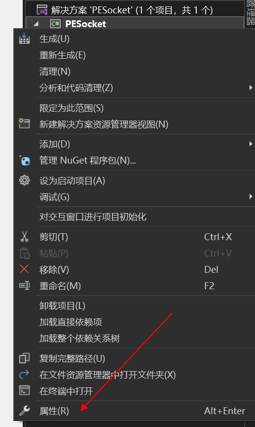
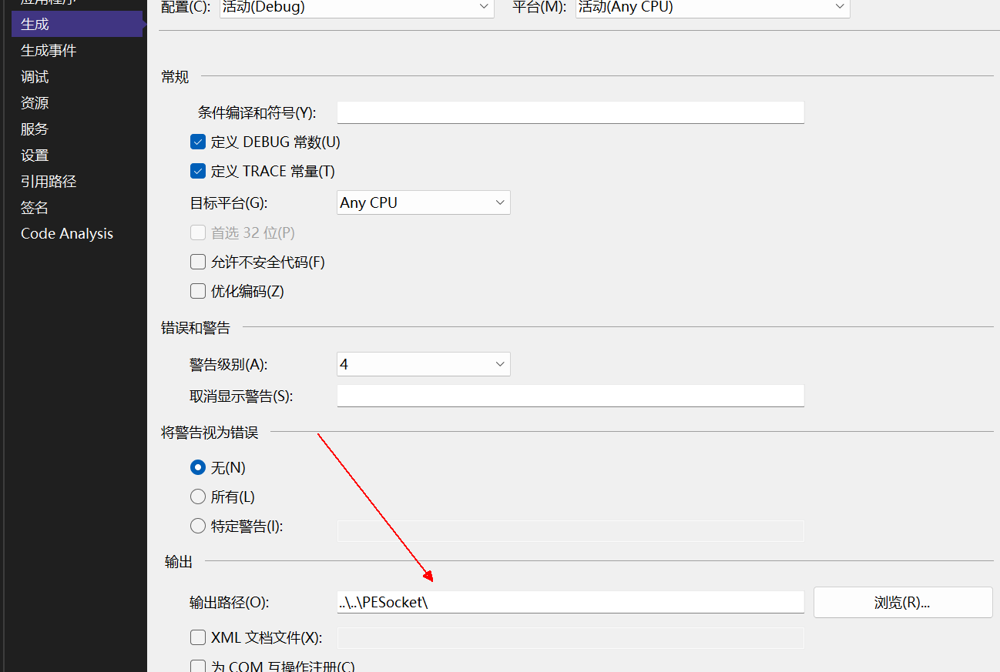
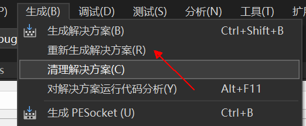
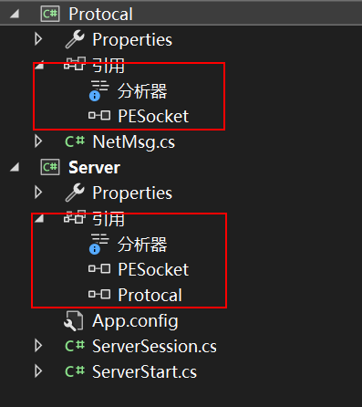
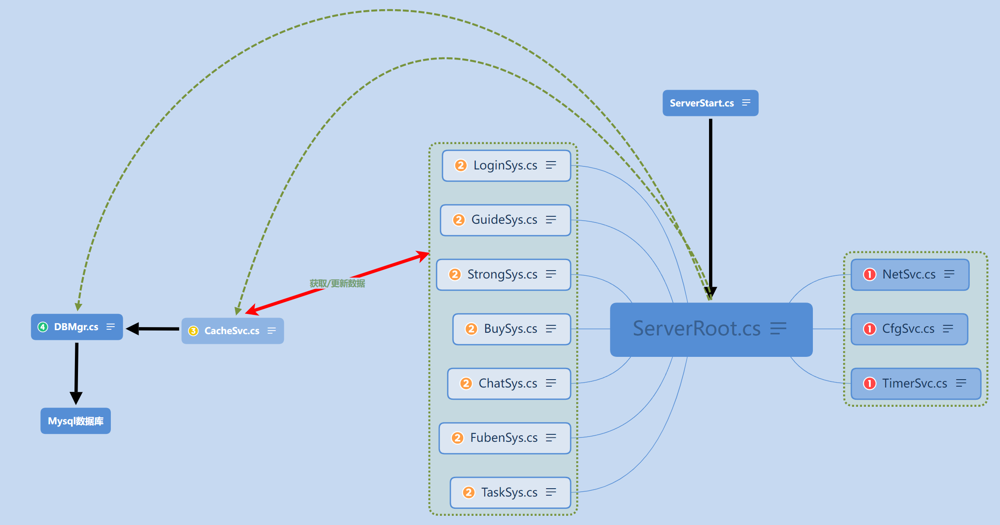
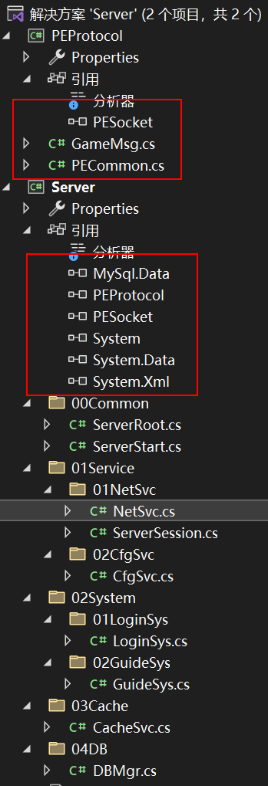

### 第3章-网络通信与服务器逻辑框架

#### 301-PEScoket框架介绍

1. 创建Socket服务器

```cs
PESocket<ClientSession, NetMsg> server = new PESocket<ClientSession, NetMsg>();
server.StartAsServer("127.0.0.1", 17666);
```

2. 创建Socket客户端

```cs
PESocket<ClientSession, NetMsg> client = new PESocket<ClientSession, NetMsg>();
client.StartAsClient("127.0.0.1", 17666);
```

3. 网络消息定义
   
   网络消息需要继承自PEMsg类，并加上[Serializable]标签，便于使用C#的序列化功能。消息体支持多层嵌套

```cs
[Serializable]
public class NetMsg : PEMsg {
    public int id;
    public string name;
    public int coin;
}
```

4. 发送网络消息
   
   使用ClientSession/ServerSession类中的SendMsg(T msg)和重载的SendMsg(byte[] data)可以分别发送打包好的网络消息或者是完成序列化的二进制网络消息

```cs
NetMsg msg = new NetMsg {
    id = 1000;
    name = "test_name";
    coin = 9999;
};

this.SendMsg(msg);
```

5. 接受网络消息
   
   在自定义的ClientSession/ServerSession类中重写OnReciveMsg(T msg)可以接受网络消息

```cs
protected override void OnReciveMsg(NetMsg msg) {
    base.OnReciveMsg(msg);

    //TODO 增加处理网络消息的业务逻辑
    PETool.LogMsg("Msg_id:" + msg.id);
    PETool.LogMsg("Msg_name:" + msg.name);
    PETool.LogMsg("Msg_coin:" + msg.coin);
}
```

6. 第三方日志工具接口
   
   通过SetLog(bool log = true, Action<string, int> logCB = null)接口，可以传入第三方日志显示工具。下方以Unity为例：

```cs
skt.SetLog(true, (string msg, int lv) => {
    switch (lv) {
        case 0:
            msg = "Log:" + msg;
            Debug.Log(msg);
            break;
        case 1:
            msg = "Warn:" + msg;
            Debug.LogWarning(msg);
            break;
        case 2:
            msg = "Error:" + msg;
            Debug.LogError(msg);
            break;
        case 3:
            msg = "Info:" + msg;
            Debug.Log(msg);
            break;
    }
});
```

#### 302-PESocket的使用方法

##### 302.1-生成dll文件

服务端使用PESocket直接将代码复制过去，客户端Unity使用时将生成的dll文件导入

1. 首先右键选择属性



2. 然后选择输出的路径



3. 最后点击生成选择重新生成解决方案



##### 302.2-创建PESocket样例服务端

样例文件结构图：



1. 首先新建一个Protocal类，里面包含了NetMsg类和IPCfg类

```cs
using PENet;
using System;

namespace Protocol {
    //由于消息需要在网络中传输因此需添加序列化
    [Serializable]
    //该消息类需要继承自PEMsg
    public class NetMsg : PEMsg {
        public string text;
    }
    //该类进行IP地址和端口号的配置
    public class IPCfg {
        public const string srvIP = "127.0.0.1";
        public const int srvPort = 17666;
    }
}
```

2. 由于Socket对象需要一个会话类于是创建ServerSession类

```cs
using PENet;
using Protocol;

//该会话类需要继承自PESession类
public class ServerSession : PESession<NetMsg> {
    //该类需要重写三个虚函数，分别时建立连接函数
    protected override void OnConnected() {
        PETool.LogMsg("Client Connect");
        SendMsg(new NetMsg {
            text = "Welcome to connect."
        });
    }
    //收到数据函数
    protected override void OnReciveMsg(NetMsg msg) {
        PETool.LogMsg("Client Req:" + msg.text);
        SendMsg(new NetMsg {
            text = "SrvRsp:" + msg.text
        });
    }
    //断开连接函数
    protected override void OnDisConnected() {
        PETool.LogMsg("Client DisConnect");
    }
}
```

3. 创建SeverStart类并初始化服务端socket对象

```cs
using PENet;
using Protocol;

namespace Server {
    internal class ServerStart {
        static void Main(string[] args) {
            //实例化服务端PESocket对象
            PESocket<ServerSession, NetMsg> server = new PESocket<ServerSession, NetMsg>();
            server.StartAsServer(IPCfg.srvIP, IPCfg.srvPort);

            while (true){
            }
        }
    }
}
```

##### 302.3-创建PESocket样例客户端

1. 首先将Protocol.dll和PESocket.dll文件直接导入Unity中

2. 接着创建会话函数

```cs
using PENet;
using Protocal;
using UnityEngine;

//同样该会话函数也需要继承自PESession
public class ClientSession : PESession<NetMsg> {
    protected override void OnConnected() {
        Debug.Log("Server Connect");
    }

    protected override void OnReciveMsg(NetMsg msg) {
        Debug.Log("Server Rsp:" + msg.text);
    }

    protected override void OnDisConnected() {
        Debug.Log("Server DisConnect");
    }
}
```

3. 然后创建启动主函数

```cs
using System.Collections;
using System.Collections.Generic;
using UnityEngine;
using Protocal;

public class GameStart : MonoBehaviour {
    PENet.PESocket<ClientSession, NetMsg> client = null;

    void Start() {
        //实例化客户端对象
        client = new PENet.PESocket<ClientSession, NetMsg>();
        client.StartAsClient(IPCfg.srvIP, IPCfg.srvPort);

        //该函数可以将服务端发生的错误打印到Unity控制台上，第一个参数为是否启用
        client.SetLog(true, (string msg, int lv) => {
            switch (lv) {
                case 0:
                    msg = "Log:" + msg;
                    Debug.Log(msg);
                    break;
                case 1:
                    msg = "Warn:" + msg;
                    Debug.LogWarning(msg);
                    break;
                case 2:
                    msg = "Error:" + msg;
                    Debug.LogError(msg);
                    break;
                case 3:
                    msg = "Info:" + msg;
                    Debug.Log(msg);
                    break;
            }
        });
    }

    void Update() {
        if (Input.GetKeyDown(KeyCode.Space)) {
            //使用PESocket中的session对象来调用SendMsg函数可以给服务端发送信息
            client.session.SendMsg(new NetMsg {
                text = "hello unity"
            });
        }
    }
}
```

#### 303-服务器框架



- 分为四层：服务层，业务系统层，缓存层，数据库层



#### 304-服务器启动逻辑

1. 服务端单例模式示例

```cs
public class ServerRoot {
    private static ServerRoot instance = null;
    //属性设置为public，外界通过属性来访问变量
    public static ServerRoot Instance {
        get {
            if (instance == null) {
                instance = new ServerRoot();
            }
            return instance;
        }
    }
}
```

2. ServerStart.cs为服务器入口类，服务器通过该函数来启动

```cs
class ServerStart {
    static void Main(string[] args) {
        ServerRoot.Instance.Init()            ;
        //保持服务器一直运行
        while (true) {
            ServerRoot.Instance.Update();
        }
    }
}
```

3. ServerRoot.cs为服务器初始化类，通过其来进行四个层次的初始化，该类要写成单例模式

```cs
public class ServerRoot {
    public void Init() {
        //数据层
        DBMgr.Instance.Init();

        //缓存层
        CacheSvc.Instance.Init();

        //服务层
        NetSvc.Instance.Init();
        CfgSvc.Instance.Init();

        //业务系统层
        LoginSys.Instance.Init();
        GuideSys.Instance.Init();
    }

    public void Update() {
        //调用网络服务的Update
        NetSvc.Instance.Update();
    }
}
```

#### 305-服务器网络服务

1. 首先构造协议类PEProtocol，内部包含了类似样例中的GameMsg类来传递网络消息和SrvCfg类来指定ip地址和端口号信息

2. 然后构造服务端会话类ServerSession，类似样例重写继承自PESession的三个虚函数

3. 最后构造网络服务类NetSvc，该类写成单例，在其初始化函数中实例化服务器对象

```cs
public class NetSvc{
    public void Init() {
        //初始化服务器PESocket对象
        PESocket<ServerSession, GameMsg> server = new PESocket<ServerSession, GameMsg>();
        server.StartAsServer(SrvCfg.srvIP, SrvCfg.srvPort);

        PECommon.Log("NetSvc Init Done.");
    }
}
```

#### 306-客户端网络服务

1. 将PEProtocol.dll和PESocket.dll导入进Unity，可以指定PEProtocol的生成路径为Unity Asset文件夹，这样每次新增协议内容后可以直接同步到Unity内部

2. 构造客户端会话类ClientSession，同样继承自PESession并重写三个虚函数

3. 初始化NetSvc类，在初始化函数中实例化客户端PESocket对象

```cs
public void InitSvc() {
    Instance = this;
    //实例化客户端PESocket对象
    client = new PESocket<ClientSession, GameMsg>();
    client.SetLog(true, (string msg, int lv) => {
        switch (lv) {
            case 0:
                msg = "Log:" + msg;
                Debug.Log(msg);
                break;
            case 1:
                msg = "Warn:" + msg;
                Debug.LogWarning(msg);
                break;
            case 2:
                msg = "Error:" + msg;
                Debug.LogError(msg);
                break;
            case 3:
                msg = "Info:" + msg;
                Debug.Log(msg);
                break;
        }
    });
    client.StartAsClient(SrvCfg.srvIP, SrvCfg.srvPort);
    PECommon.Log("Init NetSvc...");
}
```

#### 307-封装通用工具

由于其他类打印日志也都需要引入PENet命名空间来调用PETool.LogMsg函数，因此抽象出一个服务端和客户端的通用工具类，并将该类写在协议类PEProtocl中，这样两边都能使用

```cs
using PENet;
//定义日志的枚举类型，要和源码中的LogLevel保持一致
public enum LogTypeNew {
    Log = 0,
    Warn = 1,
    Error = 2,
    Info = 3
}

public class PECommon {
    //封装通用的工具类
    public static void Log(string msg = "", LogTypeNew tp = LogTypeNew.Log) {
        LogLevel lv = (LogLevel)tp;
        PETool.LogMsg(msg, lv);
    }
}
```

#### 308-登录协议定制

1. 在客户端的NetSvc类中实现一个SendMsg函数来实现网络消息的发送

```cs
public void SendMsg(GameMsg msg) {
    //如果session对象不为空则调用其SendMsg函数
    if (client.session != null) {
        client.session.SendMsg(msg);
    }
    else {
        //若session对象为空说明连接建立有问题，则重新建立连接
        GameRoot.AddTips("服务器未连接");
        InitSvc();
    }
}
```

2. 对协议类PEProtocol中的GameMsg类的属性进行规范化，实现登录数据的传输格式

```cs
//PESocket.dll中的PEMsg类
namespace PENet {
    [Serializable]
    public abstract class PEMsg {
        public int seq;
        //cmd字段表示该消息为什么类型
        public int cmd;
        public int err;
    }
}

//PEProtocol.dll中
[Serializable]
public class GameMsg : PEMsg {
    //登录请求对象
    public ReqLogin reqLogin;
    //登录回应对象，后续讲
    public RspLogin rspLogin;
}

//由于是网络传输的消息，同样需要序列化
[Serializable]
public class ReqLogin {
    //请求信息包含了账号和密码
    public string acct;
    public string pass;
}

//用来对应PEMsg中的cmd字段，使用枚举类型便于阅读
//可以用来判断接收到不同类型的消息做不同的操作
public enum CMD {
    None = 0;
    //登录相关 从100开始
    ReqLogin = 101,
    RspLogin = 102
}
```

3. 完成LoginWnd类中点击进入游戏按钮后发送网络消息的函数

```cs
    public void ClickEnterBtn() {
        audioSvc.PlayUIAudio(Constants.UILoginBtn);

        string _acct = iptAcct.text;
        string _pass = iptPass.text;
        if (_acct != "" && _pass != "") {
            //更新本地存储的账号密码
            PlayerPrefs.SetString("Acct", _acct);
            PlayerPrefs.SetString("Pass", _pass);

            //发送网络消息，请求登录
            GameMsg msg = new GameMsg {
                //指定cmd字段为登录请求
                cmd = (int)CMD.ReqLogin,
                //实例化登录请求对象
                reqLogin = new ReqLogin {
                    acct = _acct,
                    pass = _pass
                }
            };
            //调用网络服务对象来发送网络消息
            netSvc.SendMsg(msg);
        }
        else {
            GameRoot.AddTips("账号或密码为空");
        }
    }
```

#### 309-登录消息分发处理

1. 服务端在收到客户端发来的消息后调用网络服务将该消息放入消息队列中，该操作在ServerSession类的接收消息函数中进行处理

```cs
protected override void OnReciveMsg(GameMsg msg) {
    PECommon.Log("SessionID:" + sessionID + " RcvPack CMD:" + ((CMD)msg.cmd).ToString());
    //调用网络服务将该消息存入消息队列中
    NetSvc.Instance.AddMsgQue(this, msg);
}
```

2. lock关键字介绍

> lock 关键字可以用来确保代码块完成运行，而不会被其他线程中断。它可以把一段代码定义为互斥段（critical section），互斥段在一个时刻内只允许一个线程进入执行，而其他线程必须等待，语句定义：lock (x) {}，其中x代表希望跟踪的对象，通常是对象引用

3. 在NetSvc类中应该实现下列函数

```cs
//定义一个消息数据包类，包含了会话对象以及消息对象
//因为服务端回复客户端时需要使用session对象来调用SendMsg函数
public class MsgPack {
    public ServerSession session;
    public GameMsg msg;
    public MsgPack(ServerSession session, GameMsg msg) {
        this.session = session;
        this.msg = msg;
    }
}

//声明一个静态的只读的变量作为lock的参数
public static readonly string obj = "lock";
private Queue<MsgPack> msgPackQue = new Queue<MsgPack>();

public void AddMsgQue(ServerSession session, GameMsg msg) {
    //由于是多线程异步通信，进队列时需要使用lock语句
    lock (obj) {
        msgPackQue.Enqueue(new MsgPack(session, msg));
    }
}

//该Update函数调用：ServerStart(在死循环中调用) -> ServerRoot -> NetSvc
//在Update函数中一直判断是否可以出队列
public void Update() {
    if (msgPackQue.Count > 0) {
        //显示队列中中消息包的数量
        PECommon.Log("QueCount:" + msgPackQue.Count);
        lock (obj) {
            MsgPack pack = msgPackQue.Dequeue();
            //对不同的消息包进行不同的分发操作
            HandOutMsg(pack);
        }
    }
}

private void HandOutMsg(MsgPack pack) {
    //通过cmd字段来判断应当执行的操作
    switch ((CMD)pack.msg.cmd) {
        case CMD.ReqLogin:
            LoginSys.Instance.ReqLogin(pack);
            break;
        case CMD.ReqRename:
            LoginSys.Instance.ReqRename(pack);
            break;
        case CMD.ReqGuide:
            GuideSys.Instance.ReqGuide(pack);
            break;
    }
}
```

#### 310-登录请求回应逻辑

##### 310.1-增加回应类和玩家数据类

PEProtocol命名空间中增加登录请求回应的RspLogin类，存储玩家账号数据的PlayerData类

```cs
[Serializable]
public class RspLogin {
    //登录请求回应消息中包含了玩家账号数据
    public PlayerData playerData;
}

//该类同样需要序列化
[Serializable]
public class PlayerData {
    public int id;
    public string name;
    public int lv;
    public int exp;
    public int power;
    public int coin;
    public int diamond;
    //TOADD
}
```

##### 310.2-增加数据缓存层

1. PEProtocol命名空间中增加错误码类ErrorCode

```cs
//该枚举对应PEMsg中的err字段，用来表示错误类别
public enum ErrorCode {
    None = 0,//没有错误
    ServerDataError,//服务器数据异常
    UpdateDBError,//更新数据库错误

    AcctIsOnline,//账号已经上线
    WrongPass,//密码错误
    NameIsExist,//名字已经存在
}
```

2. 新增数据缓存服务CacheSvc，该类也要实现单例，同时在ServerRoot中进行初始化，并在LoginSys调用该实例，该类需要缓存已经上线的账号来给LoginSys进行判断

```cs
public class CacheSvc {
    //用字典保存玩家的账号以及其对应的会话连接
    private Dictionary<string, ServerSession> onLineAcctDic = new Dictionary<string, ServerSession>();
    //该函数返回是否在缓存中查找到此账号来判断在线情况
    public bool IsAcctOnLine(string acct) {
        return onLineAcctDic.ContainsKey(acct);
    }
}
```

3. 缓存层也需要新增GetPlayerData函数来判断未上线的账号数据是否存在来给LoginSys进行判断

```cs
//根据账号密码返回对应的账号数据，密码错误返回null，账号不存在则默认创建新账号
public PlayerData GetPlayerData(string acct, string pass) {
    //进入数据库来查找，后续介绍
    return dbMgr.QueryPlayerData(acct, pass);
}
```

4. 增加AcctOnline函数来缓存上线的玩家数据

```cs
//使用字典保存玩家数据以及其对应的会话连接
private Dictionary<ServerSession, PlayerData> onLineSessionDic = new Dictionary<ServerSession, PlayerData>();
//缓存已上线的账号，对应的会话连接，以及其玩家数据
public void AcctOnline(string acct, ServerSession session, PlayerData playerData) {
    //向上述两个字典中增加数据
    onLineAcctDic.Add(acct, session);
    onLineSessionDic.Add(session, playerData);
}
```

##### 310.3-登录请求回应函数

登录请求回应操作应该在LoginSys即业务系统层进行，该类中实现ReqLogin(MsgPack pack)函数

```cs
public void ReqLogin(MsgPack pack) {
    //获取传入的请求消息对象
    ReqLogin data = pack.msg.reqLogin;
    //实例化回应消息对象
    GameMsg msg = new GameMsg {
        cmd = (int)CMD.RspLogin
    };
    //判断此账号是否上线
    if (cacheSvc.IsAcctOnLine(data.acct)) {
        //己上线：返回错误信息，将回应消息对象中err字段置为相应错误码
        msg.err = (int)ErrorCode.AcctIsOnline;
    }
    else {
        //未上线：
        //账号是否存在 
        PlayerData pd = cacheSvc.GetPlayerData(data.acct, data.pass);
        if (pd == null) {
            //存在，密码错误
            msg.err = (int)ErrorCode.WrongPass;
        }
        else {
            //若密码正确则将玩家账号数据传入回应消息对象中
            msg.rspLogin = new RspLogin {
                playerData = pd
            };
            //在缓存中缓存该账号数据
            cacheSvc.AcctOnline(data.acct, pack.session, pd);
        }
    }
    //通过session对象调用SendMsg函数回应客户端
    pack.session.SendMsg(msg);
}
```

#### 311-客户端消息分发处理

1. 对照服务端的NetSvc类，客户端在收到登录请求回应消息后也要调用NetSvc进行处理，与服务端不同的是客户端消息队列只需要保存GameMsg即可，因为服务端的session是一对多而客户端只有一个session。同样该类需要实现对回应消息的判断并进行分发处理

```cs
private static readonly string obj = "lock";
//只需要保存GameMsg，不需要保存ession
private Queue<GameMsg> msgQue = new Queue<GameMsg>();

//消息进队列并使用lock语句
public void AddNetPkg(GameMsg msg) {
    lock (obj) {
        msgQue.Enqueue(msg);
    }
}

//客户端的Upadate函数自动执行
private void Update() {
    if (msgQue.Count > 0) {
        lock (obj) {
            GameMsg msg = msgQue.Dequeue();
            //调用消息包分发处理函数
            ProcessMsg(msg);
        }
    }
}

private void ProcessMsg(GameMsg msg) {
    //首先对其err字段进行判断，字段不为ErrorCode.None说明有错误，弹出Tips后直接返回
    if (msg.err != (int)ErrorCode.None) {
        switch ((ErrorCode)msg.err) {
            case ErrorCode.AcctIsOnline:
                GameRoot.AddTips("当前账号已经上线");
                break;
            case ErrorCode.WrongPass:
                GameRoot.AddTips("密码错误");
                break;
        }
        return;
    }
    //根据cmd字段进行消息包分发处理
    switch ((CMD)msg.cmd) {
        case CMD.RspLogin:
            //同样调用业务系统层进行处理
            LoginSys.Instance.RspLogin(msg);
            break;
    }
}
```

2. 调用LoginSys中的RspLogin函数对登录请求回应消息进行处理

```cs
public void RspLogin(GameMsg msg) {
    GameRoot.AddTips("登录成功");
    //调用GameRoot来保存收到的玩家数据信息
    GameRoot.Instance.SetPlayerData(msg.rspLogin);
    //如果是新账号则打开角色创建界面创建新角色
    if (msg.rspLogin.playerData.name == "") {
        //打开角色创建界面
        createWnd.SetWndState();
    }
    else {
        //进入主城
        MainCitySys.Instance.EnterMainCity();
    }
    //关闭登录界面
    loginWnd.SetWndState(false);
}
```

3. 玩家数据对象保存在GameRoot中，只能通过属性来获取其值和使用函数来为其赋值

```cs
//玩家数据对象指定为private不能随便访问
private PlayerData playerData = null;
//只能通过属性进行访问
public PlayerData PlayerData {
    get {
        return playerData;
    }
}
//只能通过该函数来为其赋值
public void SetPlayerData(RspLogin data) {
    playerData = data.playerData;
}
```
