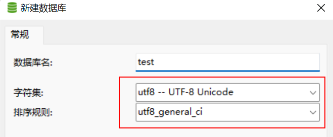
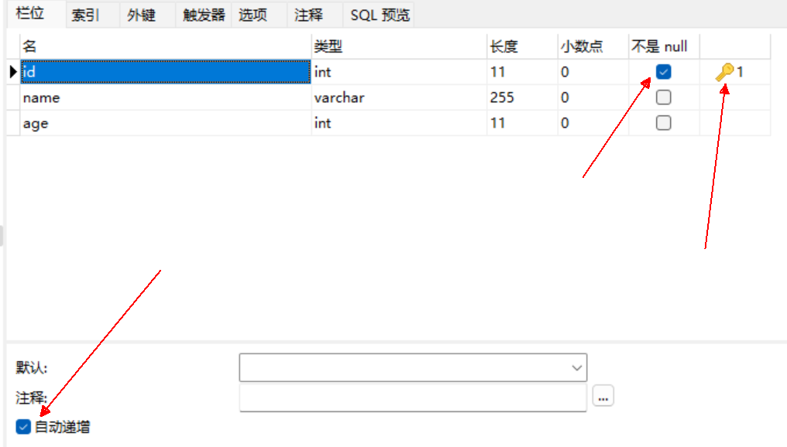
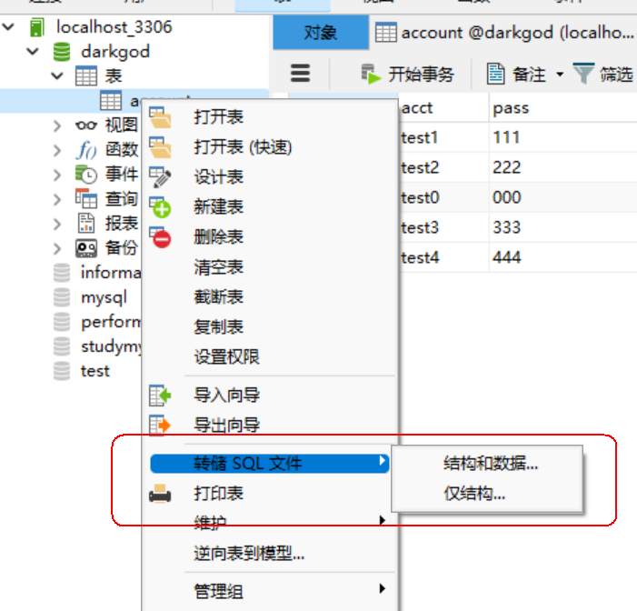
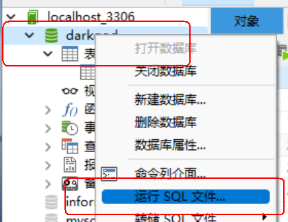
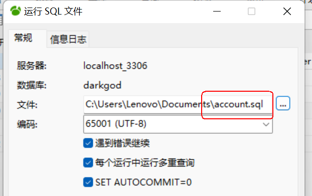

### 第4章-数据库与服务器缓存层

#### 401-Navicat使用

1. 新建数据库配置



2. id设置



3. VS中操作数据库

（1）首先添加MySqlData.dll

（2）代码示例

```cs
using System;
using MySql.Data.MySqlClient;

class Program {
    //首先声明数据库连接
    static MySqlConnection conn = null;
    static void Main(string[] args) {
        //server中指定连接服务器的IP地址，本地则写localhost，其他信息可以右键数据库查看连接信息
        conn = new MySqlConnection("server=localhost;User Id = root;passwrod=;Database=studymysql;Charset = utf8");
        conn.Open();

        conn.Close();
    }

    static void Add() {
        //实例化指令对象
        MySqlCommand cmd = new MySqlCommand("insert into userinfo set name='xixi',age=96 ", conn);
        //指令执行
        cmd.ExecuteNonQuery();
        //插入数据后一般获取最近一次插入的数据的主键信息
        int id = (int)cmd.LastInsertedId;
        Console.WriteLine("Sql Insert Key:{0}", id);
    }

    static void Delete() {
        MySqlCommand cmd = new MySqlCommand("delete from userinfo where id = 1", conn);
        cmd.ExecuteNonQuery();
        Console.WriteLine("delete done");
    }

    static void Update() {
        //使用@符号便于修改数据，同时可以防止Sql注入
        MySqlCommand cmd = new MySqlCommand("update userinfo set name=@name,age=@age where id =@id", conn);
        cmd.Parameters.AddWithValue("name", "xoxo");
        cmd.Parameters.AddWithValue("age", 123);
        cmd.Parameters.AddWithValue("id", 2);

        cmd.ExecuteNonQuery();
        Console.WriteLine("update done");
    }

    static void Query() {
        //MySqlCommand cmd = new MySqlCommand("select * from userinfo", conn);
        MySqlCommand cmd = new MySqlCommand("select * from userinfo where age=66", conn);
        //解析收到的数据
        MySqlDataReader reader = cmd.ExecuteReader();
        //调用Read()判断是否有数据
        while (reader.Read()) {
            int id = reader.GetInt32("id");
            string name = reader.GetString("name");
            int age = reader.GetInt32("age");
            Console.WriteLine(string.Format("sql result: id:{0} name:{1} age:{2}", id, name, age));
        }
    }
}
```

#### 402-增加数据库管理器

创建数据库，account表 => 在服务端中增加数据库管理层DBMgr.cs（写成单例） => 在ServerRoot中调用

1. 初始化数据库连接

```cs
private MySqlConnection conn;
public void Init() {
    conn = new MySqlConnection("server=localhost;User Id=root;passwrod=;Database=darkgod;Charset=utf8");
    conn.Open();
    PECommon.Log("DBMgr Init Done.");
}
```

2. 增加根据玩家账号和密码来查找玩家数据函数QueryPlayerData

```cs
public PlayerData QueryPlayerData(string acct, string pass) {
    //默认是新账号
    bool isNew = true;
    PlayerData playerData = null;
    //解析从数据库中获取的数据
    MySqlDataReader reader = null;
    //使用try...catch...finally语句可以在出现错误时不会直接退出程序
    try {
        //使用@符号判断是否存在该账号的玩家数据
        MySqlCommand cmd = new MySqlCommand("select * from account where acct = @acct", conn);
        cmd.Parameters.AddWithValue("acct", acct);
        reader = cmd.ExecuteReader();
        if (reader.Read()) {
            //如果读取到了数据说明不是新账号
            isNew = false;
            string _pass = reader.GetString("pass");
            //字符串判断用Equals函数
            if (_pass.Equals(pass)) {
                //密码正确，返回玩家数据
                playerData = new PlayerData {
                    id = reader.GetInt32("id"),
                    name = reader.GetString("name"),
                    lv = reader.GetInt32("level"),
                    exp = reader.GetInt32("exp"),
                    power = reader.GetInt32("power"),
                    coin = reader.GetInt32("coin"),
                    diamond = reader.GetInt32("diamond"),
                    //TOADD
                };
            }
        }
    }
    catch (Exception e) {
        PECommon.Log("Query PlayerData By Acct&Pass Error:" + e, LogTypeNew.Error);
    }
    finally {
        //在finally中关闭reader
        if (reader != null) {
            reader.Close();
        }
        if (isNew) {
            //不存在账号数据，创建新的默认账号数据，并返回
            playerData = new PlayerData {
                id = -1,
                name = "",
                lv = 1,
                exp = 0,
                power = 150,
                coin = 5000,
                diamond = 500,
                //TOADD
            };
            //调用函数将新建的玩家数据插入数据库同时返回主键id，并将id赋值给playerData的id
            playerData.id = InsertNewAcctData(acct, pass, playerData);
        }
    }
    return playerData;
}
```

3. 增加插入玩家数据函数InsertNewAcctData

```cs
    private int InsertNewAcctData(string acct, string pass, PlayerData pd) {
        int id = -1;
        try {
            MySqlCommand cmd = new MySqlCommand(
                "insert into account set acct=@acct,pass=@pass,name=@name,level=@level,exp="+
                "@exp,power=@power,coin=@coin,diamond=@diamond", conn);
            cmd.Parameters.AddWithValue("acct", acct);
            cmd.Parameters.AddWithValue("pass", pass);
            cmd.Parameters.AddWithValue("name", pd.name);
            cmd.Parameters.AddWithValue("level", pd.lv);
            cmd.Parameters.AddWithValue("exp", pd.exp);
            cmd.Parameters.AddWithValue("power", pd.power);
            cmd.Parameters.AddWithValue("coin", pd.coin);
            cmd.Parameters.AddWithValue("diamond", pd.diamond);
            //TOADD
            cmd.ExecuteNonQuery();
            //获取主键id
            id = (int)cmd.LastInsertedId;
        }
        catch (Exception e) {
            PECommon.Log("Insert PlayerData Error:" + e, LogTypeNew.Error);
        }
        return id;
    }
```

#### 403-重命名功能协议定制

更改协议PEProtocol.dll，在其中增加相应属性和类

```cs
public class GameMsg : PEMsg {
    public ReqRename reqRename;
    public RspRename rspRename;
}

//新增两个类分别为请求更改名称类和回应请求更改名称类
[Serializable]
public class ReqRename {
    public string name;
}
[Serializable]
public class RspRename {
    public string name;
}

public enum ErrorCode {
    NameIsExist,//名字已经存在
}

public enum CMD {
    ReqRename = 103,
    RspRename = 104,
} 
```

#### 404-重命名功能实现

##### 404.1-客户端发送重命名信息包

客户端在CreateWnd中点击进入游戏按钮后调用网络服务层NetSvc的函数SendMsg发送信息包

```cs
public void ClickEnterBtn() {
    audioSvc.PlayUIAudio(Constants.UIClickBtn);

    if (iptName.text != "") {
        //发送名字数据到服务器，登录主城
        GameMsg msg = new GameMsg {
            cmd = (int)CMD.ReqRename,
            reqRename = new ReqRename {
                name = iptName.text
            }
        };
        //调用网络服务层发送信息
        netSvc.SendMsg(msg);
    }
    else {
        GameRoot.AddTips("当前名字不符合规范");
    }
}
```

##### 404.2-服务端接收信息进行分发

1. 服务端的NetSvc接收信息并调用HandOutMsg对信息包进行分发

```cs
private void HandOutMsg(MsgPack pack) {
    switch ((CMD)pack.msg.cmd) {
        case CMD.ReqRename:
            LoginSys.Instance.ReqRename(pack);
            break;
    }
}
```

2. 服务端的LoginSys中新增处理重命名消息包函数ReqRename

```cs
 public void ReqRename(MsgPack pack) {
     //获取发送过来的重命名信息对象
     ReqRename data = pack.msg.reqRename;
     GameMsg msg = new GameMsg {
         cmd = (int)CMD.RspRename
     };
     //从缓存层中调用函数判断名字是否已经存在
     if (cacheSvc.IsNameExist(data.name)) {
         //存在：返回错误码
         msg.err = (int)ErrorCode.NameIsExist;
     }
     else {
         //不存在：更新缓存，以及数据库，再返回给客户端
         //通过session来获取对应的玩家数据
         PlayerData playerData = cacheSvc.GetPlayerDataBySession(pack.session);
         playerData.name = data.name;
         //若数据库更新数据失败则返回错误码
         if (!cacheSvc.UpdatePlayerData(playerData.id, playerData, pack.session)) {
             msg.err = (int)ErrorCode.UpdateDBError;
         }
         else {
         //更新成功则实例化回应重命名请求信息包对象
             msg.rspRename = new RspRename {
                 name = data.name
             };
         }
     }
     //通过session对象调用函数发送信息包
     pack.session.SendMsg(msg);
 }
```

##### 404.3-服务端缓存层更新

1. 缓存层实现通过session来获取玩家数据函数

```cs
public PlayerData GetPlayerDataBySession(ServerSession session) {
    //通过字典查询
    if (onLineSessionDic.TryGetValue(session, out PlayerData playerData)) {
        return playerData;
    }
    else {
        return null;
    }
}
```

2. 缓存层实现查找玩家名称是否在数据库存在函数

```cs
public bool IsNameExist(string name) {
    //调用数据库通过名称查找玩家数据函数
    return dbMgr.QueryNameData(name);
}
```

3. 缓存层实现更新数据库中玩家数据函数（也更新缓存中的字典）

```cs
public bool UpdatePlayerData(int id, PlayerData playerData, ServerSession session) {
    //更新缓存中字典
    onLineSessionDic[session] = playerData;
    //调用数据库更新玩家数据函数更新数据库中数据
    return dbMgr.UpdatePlayerData(id, playerData);
}
```

##### 404.4-服务端数据库管理层更新

1. 数据库管理层实现通过玩家名称查找玩家数据函数

```cs
public bool QueryNameData(string name) {
    //先默认查找不到
    bool exist = false;
    MySqlDataReader reader = null;
    try {
        //根据名称查找数据库中玩家数据
        MySqlCommand cmd = new MySqlCommand("select * from account where name= @name", conn);
        cmd.Parameters.AddWithValue("name", name);
        reader = cmd.ExecuteReader();
        //如果reader不为空说明找到了该名称的玩家数据
        if (reader.Read()) {
            exist = true;
        }
    }
    catch (Exception e) {
        PECommon.Log("Query Name State Error:" + e, LogTypeNew.Error);
    }
    finally {
        //在finally中关闭reader
        if (reader != null) {
            reader.Close();
        }
    }
    return exist;
}
```

2. 数据库管理层实现通过主键id更新数据库中玩家数据函数

```cs
public bool UpdatePlayerData(int id, PlayerData playerData) {
    try {
        //根据id查找对应玩家数据
        MySqlCommand cmd = new MySqlCommand(
        "update account set name=@name,level=@level,exp=@exp,power=@power,coin="+
        "@coin,diamond=@diamond where id =@id", conn);
        cmd.Parameters.AddWithValue("id", id);
        cmd.Parameters.AddWithValue("name", playerData.name);
        cmd.Parameters.AddWithValue("level", playerData.lv);
        cmd.Parameters.AddWithValue("exp", playerData.exp);
        cmd.Parameters.AddWithValue("power", playerData.power);
        cmd.Parameters.AddWithValue("coin", playerData.coin);
        cmd.Parameters.AddWithValue("diamond", playerData.diamond);
        //TOADD Others
        cmd.ExecuteNonQuery();
    }
    catch (Exception e) {
        PECommon.Log("Update PlayerData Error:" + e, LogTypeNew.Error);
        return false;
    }
    return true;
}
```

##### 404.5-客户端对回应信息分发

1. 客户端的NetSvc接收回应信息包并判断其err和cmd字段进行处理

```cs
private void ProcessMsg(GameMsg msg) {
    if (msg.err != (int)ErrorCode.None) {
        switch ((ErrorCode)msg.err) {
            case ErrorCode.UpdateDBError:
                PECommon.Log("数据库更新异常", LogTypeNew.Error);
                GameRoot.AddTips("网络不稳定"); 
                break;
        }
        return;
    }
    switch ((CMD)msg.cmd) {
        case CMD.RspRename:
            LoginSys.Instance.RspRename(msg);
            break;
    }
}
```

2. 客户端LoginSys中新增处理回应重命名信息包函数RspRename

```cs
public void RspRename(GameMsg msg) {
    //更新GameRoot中的玩家数据对象
    GameRoot.Instance.SetPlayerName(msg.rspRename.name);

    //跳转场景进入主城
    //打开主城的界面
    MainCitySys.Instance.EnterMainCity();
    //关闭创建界面
    createWnd.SetWndState(false);
}
```

3. 更新GameRoot中的玩家数据对象

```cs
public void SetPlayerName(string name) {
    PlayerData.name = name;
}
```

#### 405-备份数据库数据

1. 备份数据库中的表



2. 读取备份的数据




