### 第5章-主城UI逻辑与人物控制

#### 501-制作主城场景

1. 可以设置物体在光照贴图中的比重

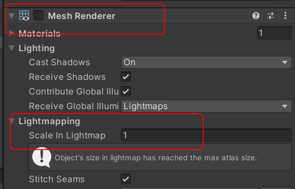

2. 查看场景渲染批次

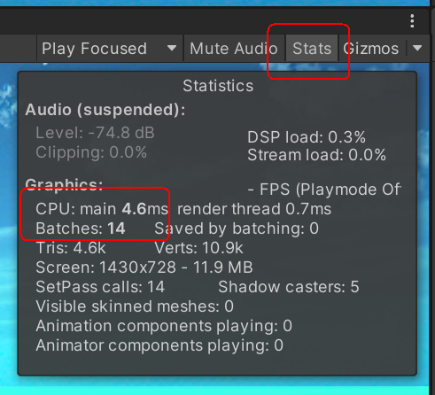

#### 502-跳转主城场景

1. 首先构造MainCitySys业务系统类，写成单例并挂载到GameRoot对象上，GameRoot类中也要对其进行初始化，再构造MainCityWnd界面窗口类，并在MainCitySys中声明其引用，同时在Unity中赋值。

2. 主城跳转逻辑：LoginSys中RspLogin和RspRename函数调用MainCitySys中EnterMainCity函数进行跳转（注：异步加载场景记得将场景文件加入Build Setting中）

```cs
public void EnterMainCity() {
    //该类后续讲
    MapCfg mapData = resSvc.GetMapCfgData(Constants.MainCityMapID); 
    //异步场景跳转
    resSvc.AsyncLoadScene(mapData.sceneName, () => {
        PECommon.Log("Enter MainCity...");
        //加载游戏主角
        //打开主城场景UI
        mainCityWnd.SetWndState();
        //播放主城背景音乐
        audioSvc.PlayBGMusic(Constants.BGMainCity);
    });
}
```

3. 修复AudioListener警告：讲场景中的AudioListener添加到GameRoot上

#### 503-主城UI显示逻辑

##### 503.1-通用函数设计

计算角色战力，体力上限，人物升级经验需要在服务器和客户端通用，因此将函数写在协议PEProtocol的PECommon类中

```cs
public class PECommon {
    //使用公式来计算战力
    public static int GetFightByProps(PlayerData pd) {
        return pd.lv * 100 + pd.ad + pd.ap + pd.addef + pd.apdef;
    }
    //根据人物等级来计算体力上限
    public static int GetPowerLimit(int lv) {
        return ((lv - 1) / 10) * 150 + 150;
    }
    //简单计算人物升级所需经验
    public static int GetExpUpValBylv(int lv) {
        return 100 * lv * lv;
    }
}
```

##### 503.2-经验条设计

1. 经验条父物体锚点设置，在画面缩放时经验条也要铺满底部

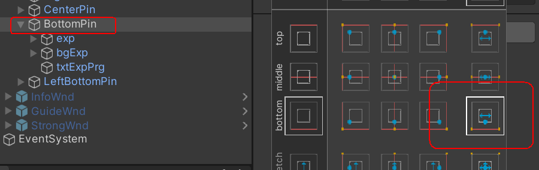

- 经验条图片的父物体锚点设置

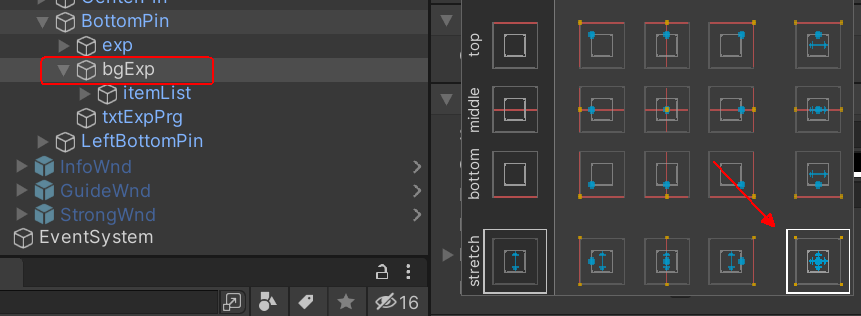

- 经验条图片列表的设置，首先设置锚点，然后添加布局组件

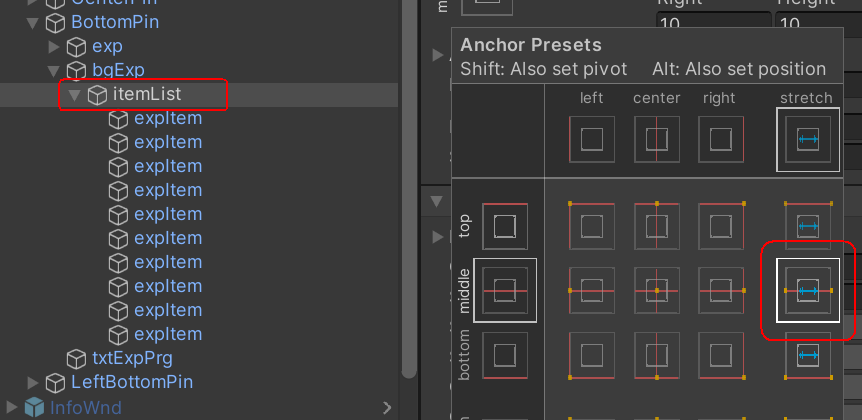

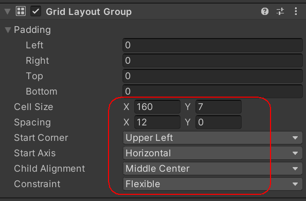

- 经验条图片的ImageType需要设置成Filled

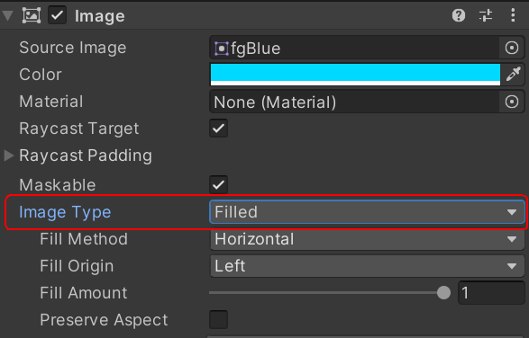

2. 动态变更经验条长度实现自适应，同时根据经验值设置经验条图片

```cs
public void RefreshUI() {
    //设置经验条百分比
    int expPrgVal = (int)(pd.exp * 1.0f / PECommon.GetExpUpValBylv(pd.lv) * 100);
    SetText(txtExpPrg, expPrgVal + "%");
    //获取未满的那个经验条索引
    int index = expPrgVal / 10;

    //通过Tramsform对象获取到挂载的布局组件
    GridLayoutGroup grid = expPrgTrans.GetComponent<GridLayoutGroup>();
    //计算屏幕缩放比例，用高度计算因为UI缩放设置为了根据高度进行缩放
    float globalRate = 1.0F * Constants.ScreenStandardHeight / Screen.height;
    //得到缩放后的宽度
    float screenWidth = Screen.width * globalRate;
    //计算每个经验条的宽度（180是各个间隙和其他组件的长度和）
    float width = (screenWidth - 180) / 10;
    //设置布局组件中的每个元素的大小，通过cellSize设置
    grid.cellSize = new Vector2(width, 7);

    //对布局对象底下子物体的fillAmount数值进行设置
    for (int i = 0; i < expPrgTrans.childCount; i++) {
        Image img = expPrgTrans.GetChild(i).GetComponent<Image>();
        if (i < index) {
            img.fillAmount = 1;
        }
        else if (i == index) {
            //根据索引对未满的经验条百分比进行设置
            img.fillAmount = expPrgVal % 10 * 1.0f / 10;
        }
        else {
            img.fillAmount = 0;
        }
    }
}
```

##### 503.3-UI窗口的刷新赋值

在MainCItyWnd中实现RefreshUI函数实现根据数据库读到的玩家数据对UI相关组件进行赋值，该函数在该窗口类初始化Init函数中进行调用

```cs
public void RefreshUI()
{
    //从GameRoot中获取玩家数据
    PlayerData pd = GameRoot.Instance.PlayerData;
    SetText(txtFight, "战力:" + PECommon.GetFightByProps(pd));
    SetText(txtPower, "体力:" + pd.power + "/" + PECommon.GetPowerLimit(pd.lv));
    imgPowerPrg.fillAmount = pd.power * 1.0f / PECommon.GetPowerLimit(pd.lv);
    SetText(txtLevel, pd.lv);
    SetText(txtName, pd.name);
    //加上上面经验条设置
}
```

#### 504-下线数据清理

1. 为了使多个客户端连接显示的明显一点，在与服务器连接时新增SessionID字段，该值通过调用ServerRoot赋值

```cs
public class ServerRoot {
    private int SessionID = 0;
    public int GetSessionID() {
        //如果SessionId到达最大值则归零
        if (SessionID == int.MaxValue) {
            SessionID = 0;
        }
        //每次调用将SessionID加1
        return SessionID += 1;
    }
}

public class ServerSession : PESession<GameMsg> {
    public int sessionID = 0;
    protected override void OnConnected() {
        //建立连接的时候调用ServerRoot来为sessionID赋值
        sessionID = ServerRoot.Instance.GetSessionID();
        PECommon.Log("SessionID:" + sessionID + " Client Connect");
    }
}
```

2. 账号下线时需要清楚缓存层中字典存储的数据，通过ServerSession => LoginSys => CacheSvc

```cs
public class ServerSession : PESession<GameMsg> {
    protected override void OnDisConnected() {
        //下线时调用LoginSys来清除缓存
        LoginSys.Instance.ClearOfflineData(this);
        PECommon.Log("SessionID:" + sessionID + " Client Offline");
    }
}

public class LoginSys {
    //通过LoginSys进行中转
    public void ClearOfflineData(ServerSession session) {
        cacheSvc.AcctOffLine(session);
    }
}

public class CacheSvc {
    public void AcctOffLine(ServerSession session) {
        //遍历存储账号和Session的字典
        foreach (var item in onLineAcctDic) {
            if (item.Value == session) {
                onLineAcctDic.Remove(item.Key);
                break;
            }
        }
        //同时移除Session和玩家数据的字典数据
        bool succ = onLineSessionDic.Remove(session);
        PECommon.Log("Offline Result: SessionID:" + session.sessionID + " " + succ);
    }
}
```

#### 505-主菜单动画制作

1. 给主菜单父物体MenuRoot添加Animation组件并制作关闭和打开动画

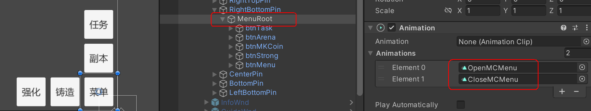

2. 在MainCityWnd中实现相关逻辑，同时在btnMenu对象上添加相关点击事件

```cs
public Animation menuAni;
public Button btnMenu;
//默认打开主城场景时主城菜单为打开状态
private bool menuState = true;

public void ClickMenuBtn() {
    audioSvc.PlayUIAudio(Constants.UIExtenBtn);
    //每一次点击按钮将当前状态取反
    menuState = !menuState;
    AnimationClip clip = null;
    if (menuState) {
        //通过GetClip函数传入名称参数来获取相应动画
        clip = menuAni.GetClip("OpenMCMenu");
    }
    else {
        clip = menuAni.GetClip("CloseMCMenu");
    }
    //Play函数需要传入AnimationClip对象的name
    menuAni.Play(clip.name);
}
```

#### 506-遥感插件制作

##### 506.1-遥感组件对象制作

1. 首先制作三张图片，imgTouch用来表示遥感按钮所在的范围大小，imgDirBg表示按钮方向的背景图片，imgDirPoint为遥感按钮

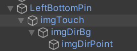

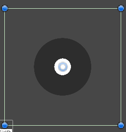

2. 在MainCityWnd中获取三个组件的引用，并在初始化时设置imgDirPoint为不显示

##### 506.2-图片点击事件制作

事件制作逻辑：写一个公共类PEListener，其中包含各种点击事件函数 => 在WindowRoot中实现各种事件函数添加组件的函数 => 在MainCityWnd中调用WindowRoot中的函数并传入相应参数

1. PEListener:

```cs
//引入EventSystems命名空间
using UnityEngine.EventSystems;
//实现按下，抬起，拖拽三个接口
public class PEListener : MonoBehaviour, IPointerDownHandler, IPointerUpHandler, IDragHandler {
    //分别初始化对应三种点击事件的委托对象
    public Action<PointerEventData> onClickDown;
    public Action<PointerEventData> onClickUp;
    public Action<PointerEventData> onDrag;

    public void OnPointerDown(PointerEventData eventData) {
        //若委托对象不为空则执行回调并将eventData作为参数传入
        if (onClickDown != null) {
            onClickDown(eventData);
        }     
    }
    public void OnPointerUp(PointerEventData eventData) {
        if (onClickUp != null) {
            onClickUp(eventData);
        }
    }
    public void OnDrag(PointerEventData eventData) {
        if (onDrag != null) {
            onDrag(eventData);
        }
    }
}
```

2. WindowRoot：

```cs
using UnityEngine.EventSystems;

public class WindowRoot : MonoBehaviour {
    //该泛型函数用来判断对象上是否挂有T组件
    protected T GetOrAddComponent<T>(GameObject go) where T : Component {
        T t = go.GetComponent<T>();
        //如果没挂载则为其挂载T组件
        if (t==null) {
            t = go.AddComponent<T>();
        }
        return t;
    }
    //为go对象挂载上PEListener组件，并对listener对象中的委托进行赋值
    protected void OnClickDown(GameObject go, Action<PointerEventData> cb) {
        PEListener listener = GetOrAddComponent<PEListener>(go);
        listener.onClickDown = cb;
    }
    protected void OnClickUp(GameObject go, Action<PointerEventData> cb) {
        PEListener listener = GetOrAddComponent<PEListener>(go);
        listener.onClickUp = cb;
    }
    protected void OnDrag(GameObject go, Action<PointerEventData> cb) {
        PEListener listener = GetOrAddComponent<PEListener>(go);
        listener.onDrag = cb;
    }
}
```

3. MainCityWnd：

```cs
public class MainCityWnd : WindowRoot {
    //用来指示遥感按钮可以移动的距离
    private float pointDis;
    //记录遥感按钮移动前一次的位置
    private Vector2 startPos = Vector2.zero;
    //记录遥感按钮背景的初始位置
    private Vector2 defaultPos = Vector2.zero;

    protected override void InitWnd() {
        base.InitWnd();
        //根据高度来计算屏幕缩放后的遥感移动距离
        pointDis = Screen.height * 1.0f / Constants.ScreenStandardHeight * Constants.ScreenOPDis;
        //在初始化函数中赋值为遥感按钮背景初始位置
        defaultPos = imgDirBg.transform.position;
        SetActive(imgDirPoint, false);
        //在初始化函数中调用
        RegisterTouchEvts();
        RefreshUI();
    }

    public void RegisterTouchEvts() {
        OnClickDown(imgTouch.gameObject, (PointerEventData evt) => {
            //获取移动前的位置坐标
            startPos = evt.position;
            SetActive(imgDirPoint);
            imgDirBg.transform.position = evt.position;
        });
        OnClickUp(imgTouch.gameObject, (PointerEventData evt) => {
            //抬起时将遥感按钮背景回归初始位置
            imgDirBg.transform.position = defaultPos;
            SetActive(imgDirPoint, false);
            //遥感按钮初始位置赋值需要使用localPosition，因为其相对于父物体位置偏移为0
            imgDirPoint.transform.localPosition = Vector2.zero;
        });
        OnDrag(imgTouch.gameObject, (PointerEventData evt) => {
            //获取移动的方向向量
            Vector2 dir = evt.position - startPos;
            float len = dir.magnitude;
            //判断移动的距离是否超出规定的移动距离
            if (len > pointDis) {
                //若超出则调用函数ClampMagnitude限制其位置
                Vector2 clampDir = Vector2.ClampMagnitude(dir, pointDis);
                //将计算后的坐标赋值给遥感按钮
                imgDirPoint.transform.position = startPos + clampDir;
            }
            else {
                imgDirPoint.transform.position = evt.position;
            }
        });
    }
}
```

#### 507-主角人物制作

1. BlendTree添加动画：

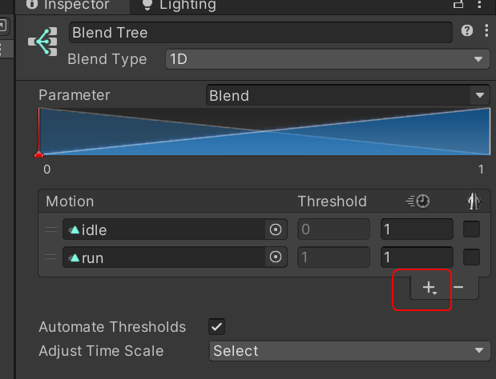

2. 主角人物需要添加角色控制器组件来控制角色移动（主角播放动画会掉落则给碰撞物加上Collider组件）：

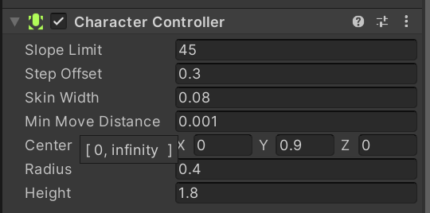

#### 508-主角运动控制

给角色增加PlayerController.cs脚本

```cs
public class PlayerController : MonoBehaviour {
    //获取相机transform来控制相机位置
    private Transform camTrans;
    //定义相机相对角色的偏移向量，该向量用来计算运动时相机的位置
    private Vector3 camOffset;
    //获取角色的动画控制器和角色控制器组件
    public Animator ani;
    public CharacterController ctrl;

    //标志角色是否移动
    private bool isMove = false;
    //设置方向向量，用属性来进行取值和赋值，同时将字段设置为private不让外界访问
    private Vector2 dir = Vector2.zero;
    public Vector2 Dir {
        get { return dir; }
        //赋值时进行判断方向向量是否为零向量
        set {
            //若为零向量则判断没有进行移动
            if(value == Vector2.zero) {
                isMove = false;
            }
            //否则角色进行了移动
            else {
                isMove = true;
            }    
            dir = value;
        }
    }

    public void Init() {
        //获取主相机的位置
        camTrans = Camera.main.transform;
        //获取相机相对于角色的偏移向量
        camOffset = transform.position - camTrans.position;
    }

    private void Update() {
        //可以从键盘WASD获取相应的数据
        float h = Input.GetAxis("Horizontal");
        float v = Input.GetAxis("Vertical");
        //该向量不是标准向量需要进行标准化
        Vector2 _dir = new Vector2(h, v).normalized;
        //将该向量赋值给方向向量
        if (_dir != Vector2.zero) {
            Dir = _dir;
        }
        else {
            Dir = Vector2.zero;
        }
        //若角色移动才进行下列操作
        if (isMove) {
            //设置方向
            SetDir();
            //产生移动
            SetMove();
            //相机跟随
            SetCam();
        }
    }

    private void SetDir() {
        //SignedAngle函数返回从源向量到目标向量的夹角
        float angle = Vector2.SignedAngle(Dir, new Vector2(0, 1));
        Vector3 eulerAngles = new Vector3(0, angle, 0);
        //将偏移的角度赋值给角色transform中的Rotation向量中，相当于按Y轴旋转了angle角度
        //赋值Rotatoion向量通过属性localEulerAngles
        transform.localEulerAngles = eulerAngles;
    }

    private void SetMove() {
        //调用角色控制器中的Move方向来控制角色移动，输入参数为角色面向的方向的增量
        //需要与Time.deltaTime和角色速度相乘
        ctrl.Move(transform.forward * Time.deltaTime * Constants.PlayerMoveSpeed);
    }

    public void SetCam() {
        //通过相机偏移量来保持角色移动时相机的相对位置不变
        if (camTrans != null) {
            camTrans.position = transform.position - camOffset;
        }
    }
}
```

#### 509-平滑动画过渡

为了实现角色行走和待机状态动画的平滑过渡

```cs
public class PlayerController : MonoBehaviour {
    //定义当前和目标混合值
    private float targetBlend;
    private float currentBlend;

    private void Update() {
        float h = Input.GetAxis("Horizontal");
        float v = Input.GetAxis("Vertical");

        Vetor2 _dir = new Vector2(h, v);
        //定义方向向量时就调用设置混合值函数来指定现在角色播放什么动画
        if (_dir != Vector2.zero) {
            Dir = _dir;
            SetBlend(Constants.BlendWalk);
        }
        else {
            Dir = Vector2.zero;
            SetBlend(Constants.BlendIdle);
        }
        //如果当前混合值不等于目标混合值则调用平滑过渡混合值函数
        if (currentBlend != targetBlend) {
            UpdateMixBlend();
        }
    }
    //通过该函数来设定目标混合值
    public void SetBlend(float blend) {
        targetBlend = blend;
    }
    //通过该函数来设定当前混合值
    private void UpdateMixBlend() {
        //如果当前和目标混合值差别很小则当前混合值等于目标混合值
        //由于在Update中调用需要乘以Time.deltaTime
        if (Mathf.Abs(currentBlend - targetBlend) < Constants.AccelerSpeed * Time.deltaTime) {
            currentBlend = targetBlend;
        }
        //如果相差很大则慢慢减小或增加当前混合值来使得两者之差减小
        else if (currentBlend > targetBlend) {
            currentBlend -= Constants.AccelerSpeed * Time.deltaTime;
        }
        else {
            currentBlend += Constants.AccelerSpeed * Time.deltaTime;
        }
        //根据当前混合值来设定动画混合树的混合值
        ani.SetFloat("Blend", currentBlend);
    }
}
```

#### 510-生成与解析主城配置数据

##### 510.1-配置数据格式设计

主城配置数据xml文件：

```xml
<?xml version="1.0" encoding="UTF-8"?>
<root>
    <item ID="">
        <mapName></mapName>
        <sceneName></sceneName>    
        <power></power>    
        <mainCamPos></mainCamPos>
        <mainCamRote></mainCamRote>
        <playerBornPos></playerBornPos>
        <playerBornRote></playerBornRote>
    </item>
    <item ID="">
        <mapName></mapName>
        <sceneName></sceneName>    
        <power></power>    
        <mainCamPos></mainCamPos>
        <mainCamRote></mainCamRote>
        <playerBornPos></playerBornPos>
        <playerBornRote></playerBornRote>
    </item>
</root>
```

##### 510.2-定义配置数据类

```cs
using UnityEngine;
//继承自泛型父类，这样可以不用重复定义ID字段
public class MapCfg : BaseData<MapCfg> {
    public string mapName;
    public string sceneName;
    public Vector3 mainCamPos;
    public Vector3 mainCamRote;
    public Vector3 playerBornPos;
    public Vector3 playerBornRote;
}

public class BaseData<T> {
    public int ID;
}
```

##### 510.3-解析地图配置文件

在ResSvc中实现以下操作，该操作和解析随机名字配置文件相似

```cs
using System;
using System.Collections.Generic;
using System.Xml;
using UnityEngine;
using UnityEngine.SceneManagement;

public class ResSvc : MonoBehaviour {
    //根据ID查找地图文件配置
    private Dictionary<int, MapCfg> mapCfgDataDic = new Dictionary<int, MapCfg>();
    //该函数和随机名称配置函数类似
    private void InitMapCfg(string path) {
        TextAsset xml = Resources.Load<TextAsset>(path);
        if (!xml) {
            PECommon.Log("xml file:" + path + " not exist", LogTypeNew.Error);
        }
        else {
            XmlDocument doc = new XmlDocument();
            doc.LoadXml(xml.text);
            XmlNodeList nodLst = doc.SelectSingleNode("root").ChildNodes;
            for (int i = 0; i < nodLst.Count; i++) {
                XmlElement ele = nodLst[i] as XmlElement;
                if (ele.GetAttributeNode("ID") == null) {
                    continue;
                }
                int ID = Convert.ToInt32(ele.GetAttributeNode("ID").InnerText);
                //实例化地图配置文件对象，并对ID字段赋值
                MapCfg mc = new MapCfg {
                    ID = ID
                };
                //遍历该xml列表中的元素
                foreach (XmlElement e in nodLst[i].ChildNodes) {
                    switch (e.Name) {
                        case "mapName":
                            mc.mapName = e.InnerText;
                            break;
                        case "sceneName":
                            mc.sceneName = e.InnerText;
                            break;
                        //加大括号是为了把valArr作为临时变量
                        case "mainCamPos": {
                                //坐标数据通过','连接，因此需要调用Split函数分割
                                string[] valArr = e.InnerText.Split(',');
                                mc.mainCamPos = new Vector3(float.Parse(valArr[0]), float.Parse(valArr[1]), float.Parse(valArr[2]));
                            }
                            break;
                        case "mainCamRote": {
                                string[] valArr = e.InnerText.Split(',');
                                mc.mainCamRote = new Vector3(float.Parse(valArr[0]), float.Parse(valArr[1]), float.Parse(valArr[2]));
                            }
                            break;
                        case "playerBornPos": {
                                string[] valArr = e.InnerText.Split(',');
                                mc.playerBornPos = new Vector3(float.Parse(valArr[0]), float.Parse(valArr[1]), float.Parse(valArr[2]));
                            }
                            break;
                        case "playerBornRote": {
                                string[] valArr = e.InnerText.Split(',');
                                mc.playerBornRote = new Vector3(float.Parse(valArr[0]), float.Parse(valArr[1]), float.Parse(valArr[2]));
                            }
                            break;
                    }
                }
                //在foreach结束后将元素项加入地图配置数据字典
                mapCfgDataDic.Add(ID, mc);
            }
        }
    }
    //该函数可以根据ID获取对应地图配置数据
    public MapCfg GetMapCfgData(int id) {
        MapCfg data;
        //从字典中查找是否存在
        if (mapCfgDataDic.TryGetValue(id, out data)) {
            return data;
        }
        return null;
    }
}
```

#### 511-加载主角到主城

1. 实现ResSvc资源加载服务中加载GameObject预制体函数

```cs
//定义路径对应游戏对象预制体的字典
private Dictionary<string, GameObject> goDic = new Dictionary<string, GameObject>();
public GameObject LoadPrefab(string path, bool cache = false) {
    GameObject prefab = null;
    //先从字典获取该游戏对象
    if (!goDic.TryGetValue(path, out prefab)) {
        //若没获取到则调用Resources.Load函数从指定路径读出
        prefab = Resources.Load<GameObject>(path);
        //若需要缓存则加入字典中
        if (cache) {
            goDic.Add(path, prefab);
        }
    }
    //若读取的预制体不为空则在场景中实例化一个游戏对象
    GameObject go = null;
    if (prefab != null) {
        go = Instantiate(prefab);
    }
    return go;
}
```

2. 完成MainCitySys业务系统中进入主城函数的编写

```cs
public void EnterMainCity() {
    MapCfg mapData = resSvc.GetMapCfgData(Constants.MainCityMapID);
    resSvc.AsyncLoadScene(mapData.sceneName, () => {
        PECommon.Log("Enter MainCity...");        //加载游戏主角
        LoadPlayer(mapData);
        //打开主城场景UI
        mainCityWnd.SetWndState();
        //播放主城背景音乐
        audioSvc.PlayBGMusic(Constants.BGMainCity);
    });
}

private void LoadPlayer(MapCfg mapData) {
    //调用资源加载服务对象获取玩家角色预制体并将缓存指定为true
    GameObject player = resSvc.LoadPrefab(PathDefine.CityPlayerPrefab, true);
    //根据地图配置对象中的数据指定玩家角色的位置，旋转
    player.transform.position = mapData.playerBornPos;
    player.transform.localEulerAngles = mapData.playerBornRote;
    player.transform.localScale = new Vector3(1.5f, 1.5f, 1.5f);

    //根据配置数据初始化主相机位置，旋转
    Camera.main.transform.position = mapData.mainCamPos;
    Camera.main.transform.localEulerAngles = mapData.mainCamRote;

    //获取到玩家角色上的角色控制器组件
    playerCtrl = player.GetComponent<PlayerController>();
    playerCtrl.Init();
}
```

#### 512-方向输入对接

1. 先将PlayerController.cs中根据键盘输入控制控制方向向量的代码注释，然后在MainCitySys业务系统中实现设置方向向量的函数SetMoveDir

```cs
public void SetMoveDir(Vector2 dir) {
    //判断该向量是否为零向量
    if (dir == Vector2.zero) {
        playerCtrl.SetBlend(Constants.BlendIdle);
    }
    else {
        playerCtrl.SetBlend(Constants.BlendWalk);
    }
    //此处对角色控制器对象中的方向向量赋值
    playerCtrl.Dir = dir;
}
```

2. 在MainCityWnd窗口界面层的遥感点击函数中调用设置方向向量函数

```cs
public void RegisterTouchEvts() {
    OnClickUp(imgTouch.gameObject, (PointerEventData evt) => {
        //抬起时表示不移动传入
        MainCitySys.Instance.SetMoveDir(Vector2.zero);
    });

    OnDrag(imgTouch.gameObject, (PointerEventData evt) => {
        //方向信息传递
        MainCitySys.Instance.SetMoveDir(dir.normalized);
    });
}
```
