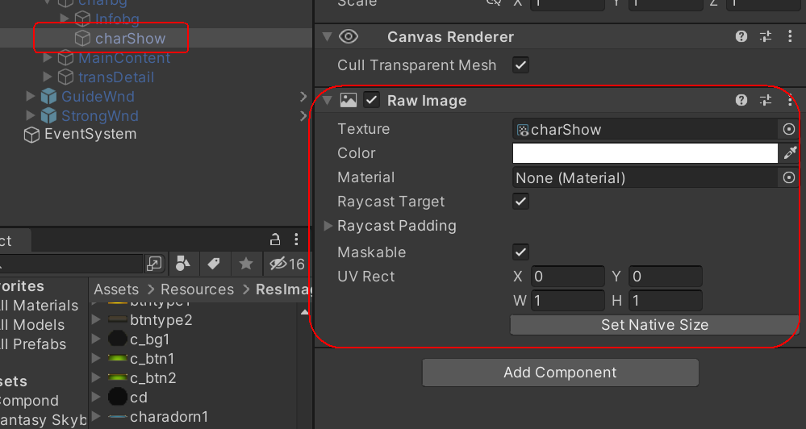
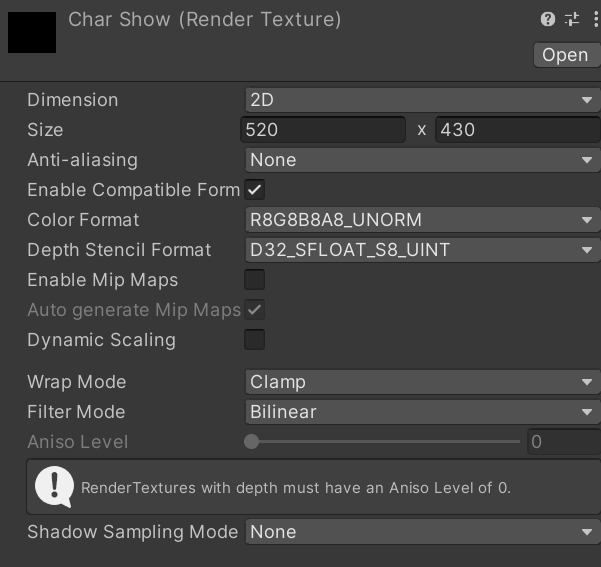
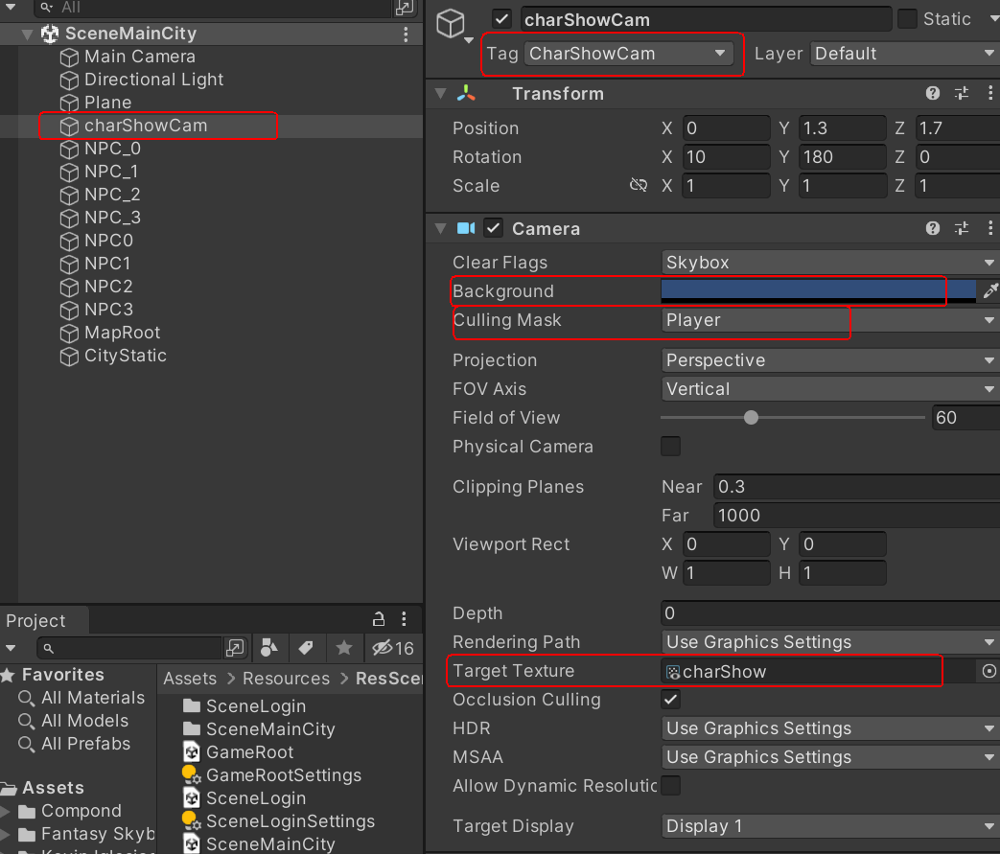
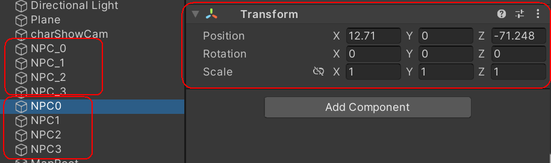
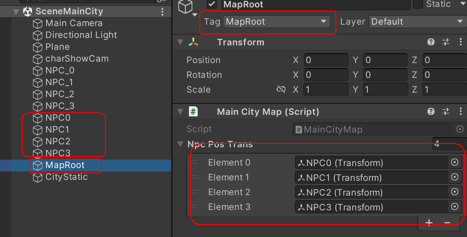
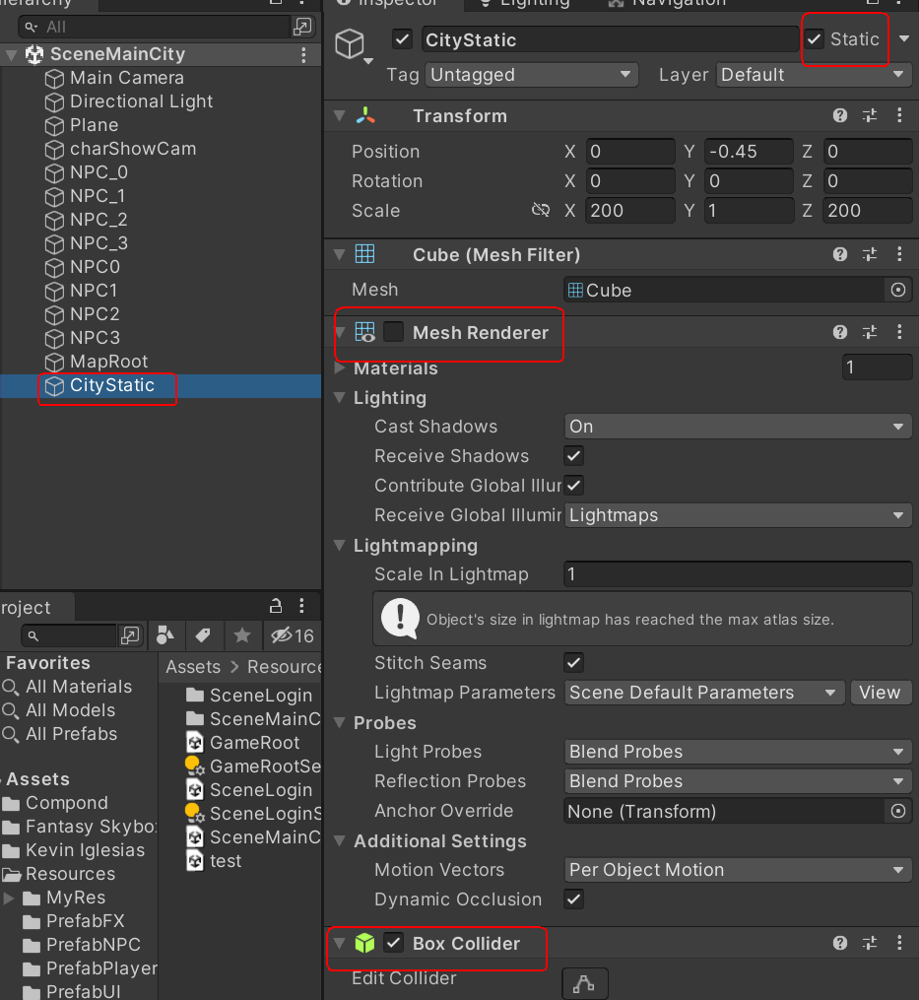
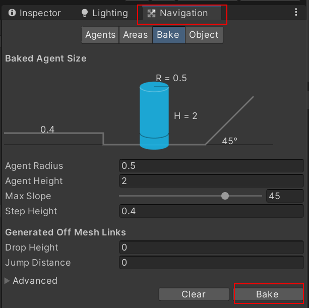
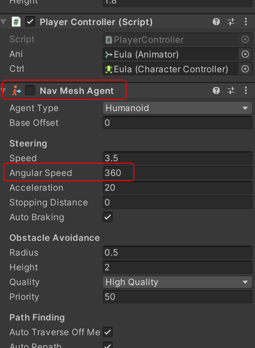
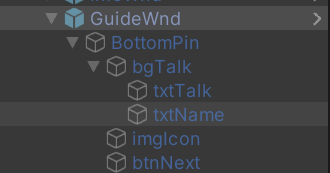

### 第6章-角色展示系统与任务引导系统

#### 601-角色信息界面制作

1. 角色展示界面的UI对象加上Raw Image组件



2. 需要右键新增Render Texture



#### 602-角色与UI混合显示

1. 将InfoWnd.cs挂载到InfoWnd对象上，然后再MainCitySys中定义打开InfoWnd的函数OpenInfoWnd，最后在MainCityWnd中添加点击事件来调用该函数打开InfoWnd面板

2. 在场景中新建角色展示摄像机，为了方便代码查找获取为其添加CharShowCam的tag，同时在新建Player层并在Culling Mask中指定Player层，最后在Target Texture中指定要渲染到的Render Texture对象



3. 然后在MainCitySys对角色展示相机进行设置

```cs
public class MainCitySys : SystemRoot {
    //获取角色展示相机的transform
    private Transform charCamTrans;
    //在进入主城时将该相机取消激活
    public void EnterMainCity() {
        if (charCamTrans != null) {
            charCamTrans.gameObject.SetActive(false);
        }
    }
    //在MainCityWnd.cs中调用
    public void OpenInfoWnd() {
        //如果没找到相机则根据Tag进行查找
        if (charCamTrans == null) {
            charCamTrans = GameObject.FindGameObjectWithTag("CharShowCam").transform;
        }
        //设置人物展示相机相对位置
        charCamTrans.localPosition = playerCtrl.transform.position + playerCtrl.transform.forward * 2.3f + new Vector3(0, 2f, 0);
        charCamTrans.localEulerAngles = new Vector3(13, 180 + playerCtrl.transform.localEulerAngles.y, 0);
        charCamTrans.localScale = new Vector3(1.5f, 1.5f, 1.5f);
        //激活该相机
        charCamTrans.gameObject.SetActive(true);
        //打开InfoWnd
        infoWnd.SetWndState();
    }
    //在InfoWnd.cs中调用
    public void CloseInfoWnd() {
        if (charCamTrans != null) {
            //关闭角色信息窗口时将该相机取消激活
            charCamTrans.gameObject.SetActive(false);
            infoWnd.SetWndState(false);
        }
    }
}
```

#### 603-实现角色旋转触控

1. 在InfoWnd中设置点击事件函数RegTouchEvts，并在InitWnd中进行调用

```cs
public class InfoWnd : WindowRoot {
    private Vector2 startPos;
    private void RegTouchEvts() {
        //在鼠标按下时记录按下点的坐标
        OnClickDown(imgChar.gameObject, (PointerEventData evt) => {
            startPos = evt.position;
            MainCitySys.Instance.SetStartRotate();
        });
        //在鼠标拖拽时计算拖拽时x轴经过的距离，并将其作为角色Y轴旋转的角度
        OnDrag(imgChar.gameObject, (PointerEventData evt) => {
            float rotate = -(evt.position.x - startPos.x) * 0.4f;
            MainCitySys.Instance.SetPlayerRotate(rotate);
        });
    }
}
```

2. 在MainCitySys中进行调用来设置角色旋转

```cs
public class MainCitySys : SystemRoot {
    private float startRotate = 0;
    //按下鼠标时调用该函数来记录拖拽前角色的旋转
    public void SetStartRotate() {
        startRotate = playerCtrl.transform.localEulerAngles.y;
    }
    //拖拽时调用该函数，角色旋转拖拽的距离加上其原本Y轴的旋转值
    public void SetPlayerRotate(float rotate) {
        playerCtrl.transform.localEulerAngles = new Vector3(0, startRotate + rotate, 0);
    }
}
```

#### 604-详细属性显示

常规操作：先定义打开，关闭按钮组件以及对应函数 => 在初始化函数中将信息展示窗口取消激活状态 => 定义打开详细属性按钮函数并在前面刷新UI界面函数RefreshUI中添加对应的属性赋值语句 => 在Unity面板中进行赋值同时添加对应的点击函数

#### 605-任务引导系统配置文件解析

##### 605.1-配置任务引导的xml文件格式

```xml
<?xml version="1.0" encoding="UTF-8"?>
<root>
    <item ID="">
        <npcID></npcID>
        <dilogArr></dilogArr>
        <actID></actID>
        <coin></coin>
        <exp></exp>
    </item>
    <item ID="">
        <npcID></npcID>
        <dilogArr></dilogArr>
        <actID></actID>
        <coin></coin>
        <exp></exp>
    </item>
</root>
```

##### 605.2-定义任务引导配置数据类

在BaseData.cs中定义自动引导任务类

```cs
public class AutoGuideCfg : BaseData<AutoGuideCfg> {
    public int npcID;   //触发任务目标NPC索引号
    public string dilogArr;
    public int actID;
    public int coin;
    public int exp;
}
```

##### 605.3-解析任务引导配置文件

在资源服务类ResSvc.cs中进行解析

```cs
public class ResSvc : MonoBehaviour {
    //在初始化函数中调用自动引导任务解析初始化函数
    public void InitSvc() {
        //在PathDefine中定义相应路径
        InitGuideCfg(PathDefine.GuideCfg);
    }
    //以下为常规解析操作
    private Dictionary<int, AutoGuideCfg> guideTaskDic = new Dictionary<int, AutoGuideCfg>();
    private void InitGuideCfg(string path) {
        TextAsset xml = Resources.Load<TextAsset>(path);
        if (!xml) {
            PECommon.Log("xml file:" + path + " not exist", LogTypeNew.Error);
        }
        else {
            XmlDocument doc = new XmlDocument();
            doc.LoadXml(xml.text);
            XmlNodeList nodLst = doc.SelectSingleNode("root").ChildNodes;
            for (int i = 0; i < nodLst.Count; i++) {
                XmlElement ele = nodLst[i] as XmlElement;
                if (ele.GetAttributeNode("ID") == null) {
                    continue;
                }
                int ID = Convert.ToInt32(ele.GetAttributeNode("ID").InnerText);
                //生成自动引导任务对象
                AutoGuideCfg mc = new AutoGuideCfg {
                    ID = ID
                };
                //遍历其字段并赋值
                foreach (XmlElement e in nodLst[i].ChildNodes) {
                    switch (e.Name) {
                        case "npcID":
                            mc.npcID = int.Parse(e.InnerText);
                            break;
                        case "dilogArr":
                            mc.dilogArr = e.InnerText;
                            break;
                        case "actID":
                            mc.actID = int.Parse(e.InnerText);
                            break;
                        case "coin":
                            mc.coin = int.Parse(e.InnerText);
                            break;
                        case "exp":
                            mc.exp = int.Parse(e.InnerText);
                            break;
                    }
                }
                //赋值完成后将对象缓存进字典中
                guideTaskDic.Add(ID, mc);
            }
        }
    }
    //该函数获取解析后缓存在字典中的的自动引导任务对象
    public AutoGuideCfg GetAutoGuideData(int id) {
        AutoGuideCfg agc = null;
        if (guideTaskDic.TryGetValue(id, out agc)) {
            return agc;
        }
        return null;
    }
}
```

#### 606-任务引导系统开发

##### 606.1-数据库配置

1. 先去数据库中设计表增加guide字段


2. 再去服务器中的GameMsg中添加相应字段

```cs
namespace PEProtocol {
    [Serializable]
    public class PlayerData {
        public int hp;
        public int ad;
        public int ap;
        public int addef;
        public int apdef;
        public int dodge;   //闪避概率
        public int pierce;   //穿透比率
        public int critical;  //暴击率  

        public int guideid;
        //TOADD
    }
}
```

3. 最后修改DBMgr.cs的QueryPlayerData，InsertNewAcctData，UpdatePlayerData即查找，插入，更新函数，向其中添加相应语句

##### 606.2-任务图标显示

1. 先去PathDefine.cs中定义图标文件路径，再去Constants.cs中定义常量

```cs
public class PathDefine {
    #region AutoGuide
    public const string TaskHead = "MyRes/Images/task";
    public const string WiseManHead = "MyRes/Images/wiseman";
    public const string GeneralHead = "MyRes/Images/general";
    public const string ArtisanHead = "MyRes/Images/artisan";
    public const string TraderHead = "MyRes/Images/trader";
    #endregion
}


public class Constants {
    //AutoGuideNPC
    public const int NPCWiseMan = 0;
    public const int NPCGeneral = 1;
    public const int NPCArtisan = 2;
    public const int NPCTrader = 3;
}
```

2. 在WindowRoot.cs中实现加载图片的函数，同时调用ResSvc实现加载并判断是否缓存

```cs
public class WindowRoot : MonoBehaviour {
    protected void SetSprite(Image img, string path) {
        //调用资源服务进行加载
        Sprite sp = resSvc.LoadSprite(path, true);
        img.sprite = sp;    
    }
}

public class ResSvc : MonoBehaviour {
    //加载图片并且缓存的逻辑和其他的加载预制体的逻辑类似
    private Dictionary<string, Sprite> spDic = new Dictionary<string, Sprite>();
    public Sprite LoadSprite(string path, bool cache = false) {
        Sprite sp = null;
        if (!spDic.TryGetValue(path, out sp)) {
            //若字典中没有则调用Resources.Load函数指定路径进行加载
            sp = Resources.Load<Sprite>(path);
            if (cache) {
                //如果需要缓存则加入字典中
                spDic.Add(path, sp);
            }
        }
        return sp;
    }
}
```

3. 在MainCityWnd.cs中实现以下操作

```cs
public class MainCityWnd : WindowRoot {
    public Button btnGuide;
    private AutoGuideCfg curtTaskData;

    public void RefreshUI() {
        //通过玩家ID获取对应的任务配置数据
        curtTaskData = resSvc.GetAutoGuideData(pd.guideid);
        if (curtTaskData != null) {
            //调用该函数设置任务图标
            SetGuideBtnIcon(curtTaskData.npcID);
        }
        else {
            //默认npcID为-1
            SetGuideBtnIcon(-1);
        }
    }
    //该函数根据npcID来加载不同的npc图标
    private void SetGuideBtnIcon(int npcID) {
        string spPath = "";
        //获取自动引导按钮上挂载的Image组件并为其赋值
        Image img = btnGuide.GetComponent<Image>();
        switch (npcID) {
            case Constants.NPCWiseMan:
                spPath = PathDefine.WiseManHead;
                break;
            case Constants.NPCGeneral:
                spPath = PathDefine.GeneralHead;
                break;
            case Constants.NPCArtisan:
                spPath = PathDefine.ArtisanHead;
                break;
            case Constants.NPCTrader:
                spPath = PathDefine.TraderHead;
                break;
            default:
                spPath = PathDefine.TaskHead;
                break;
        }
        //将指定路径图片赋值给img对象
        SetSprite(img, spPath);
    }
}
```

##### 606.3-NPC设置

1. 在Unity场景中添加NPC模型，同时设置为每个NPC设置一个空物体用来表示玩家碰到该物体时即触发与NPC的对话（也可以设置一个圆形范围）



2. 添加MapRoot空物体，并在其上挂载相应脚本用来记录主城中NPC的transform信息



```cs
public class MainCityMap : MonoBehaviour {
    public Transform[] NpcPosTrans;
}
```

3. 最后在MainCitySys初始化地图数据时拿到各个NPC的坐标信息

```cs
public class MainCitySys : SystemRoot {
    //用来存储NPC的坐标数据
    private Transform[] npcPosTrans;
    public void EnterMainCity() {
        MapCfg mapData = resSvc.GetMapCfgData(Constants.MainCityMapID);
        resSvc.AsyncLoadScene(mapData.sceneName, () =>
        {
            //通过设置的tag找到场景中MapRoot对象
            GameObject map = GameObject.FindGameObjectWithTag("MapRoot");
            //从MapRoot对象上获取脚本组件
            MainCityMap mcm = map.GetComponent<MainCityMap>();
            npcPosTrans = mcm.NpcPosTrans;
        });
    }
}
```

##### 606.4-导航系统设置

1. 首先创建需要寻路的场景对象CityStatic并将其勾选为Static，然后将场景其他所有物体取消激活状态只保存该对象激活，接着勾选该对象的Mesh Renderer和Box Collider组件为激活状态



2. 然后调出Navigation面板，在Bake选项卡中先Clear后Bake即可生成导航网格



3. 接着将所有物体激活，并把CityStatic对象上的Mesh Renderer组件取消激活状态

4. 最后为玩家角色预制体添加Nav Mesh Agent组件，并将其取消激活（因为该组件也能控制人物进行移动和Player Controller组件冲突），通过代码控制该组件的激活状态，同时将其中的Angular Speed调大一些



##### 606.5-任务系统实现

1. 首先在MainCityWnd中定义点击自动引导任务按钮事件函数

```cs
public class MainCityWnd : WindowRoot {
    public void ClickGuideBtn() {
        audioSvc.PlayUIAudio(Constants.UIClickBtn);
        //由于不同任务会触发调用不同服务，因此将执行不同任务的操作写在MainCitySys中3
        if (curtTaskData != null) {
            MainCitySys.Instance.RunTask(curtTaskData);
        }
        else {
            GameRoot.AddTips("更多引导任务，正在开发中...");
        }
    }
}
```

2. 在MainCitySys中实现导航系统

```cs
public class MainCitySys : SystemRoot {
    private AutoGuideCfg curTaskData;
    private NavMeshAgent nav;
    //在加载玩家数据时添加获取玩家身上挂载的自动导航组件
    private void LoadPlayer(MapCfg mapData) {
        GameObject player = resSvc.LoadPrefab(PathDefine.CityPlayerPrefab, true);
        nav = player.GetComponent<NavMeshAgent>();
    }
    //设置是否在导航的标志变量
    private bool isNavGuide = false;
    //该函数根据不同的npcID执行不同的操作
    public void RunTask(AutoGuideCfg agc) {
        //将任务引导数据保存
        if (agc != null) {
            curTaskData = agc;
        }

        //这里设置激活状态是为了玩家如果直接进入dis < 0.5f的逻辑后nav没激活调用不了isStopped属性
        nav.enabled = true;
        //若npcID不等于-1说明是和NPC进行对话
        if (curTaskData.npcID != -1) {
            //计算玩家和NPC之间的距离
            float dis = Vector3.Distance(playerCtrl.transform.position, npcPosTrans[agc.npcID].position);
            //若距离小于0.5f则表示到达NPC附近
            if (dis < 0.5f) {
                //导航标志置位false同时播放待机动画并将导航组件取消激活
                isNavGuide = false;
                nav.isStopped = true;
                playerCtrl.SetBlend(Constants.BlendIdle);
                nav.enabled = false;
                //打开对话窗口
                OpenGuideWnd();
            }
            else {
                //否则则一直保存导航组件激活并设置导航速度和播放人物行走动画
                isNavGuide = true;
                nav.enabled = true;
                nav.speed = Constants.PlayerMoveSpeed;
                playerCtrl.SetBlend(Constants.BlendWalk);
                //设置导航目标点即对应的NPC坐标
                nav.SetDestination(npcPosTrans[agc.npcID].position);
            }
        }
        //若等于-1则表示该任务不需要和NPC对话，直接打开系统对话窗口
        else {
            OpenGuideWnd();
        }
    }
    //需要在Update函数里一直检测导航标志变量
    private void Update() {
        //若在导航状态则需要设置相机跟随
        if (isNavGuide) {
            //需要在Update中一直检测玩家到达目标NPC直接的距离
            isArriveNavPos();
            playerCtrl.SetCam();
        }
    }
    //该函数一直判断玩家是否到达目标npc
    private void isArriveNavPos() {
        //此处调用的是curTaskData中的npcID
        float dis = Vector3.Distance(playerCtrl.transform.position, npcPosTrans[curTaskData.npcID].position);
        if (dis < 0.5f) {
            isNavGuide = false;
            nav.isStopped = true;
            playerCtrl.SetBlend(Constants.BlendIdle);
            nav.enabled = false;
            OpenGuideWnd();
        }
    }
    //该函数激活任务对话窗口
    private void OpenGuideWnd() {
        guideWnd.SetWndState();
    } 
}
```

3. 需要实现打开窗口或是移动遥感能打断导航

```cs
public class MainCitySys : SystemRoot {
    //停止导航的逻辑同上
    private void StopNavTask() {
        if (isNavGuide) {
            isNavGuide = false;
            nav.isStopped = true;
            nav.enabled = false;
            playerCtrl.SetBlend(Constants.BlendIdle);
        }
    }
    //移动遥感的时候停止导航
    public void SetMoveDir(Vector2 dir) {
        StopNavTask();
    }
    //打开玩家详细信息的时候停止导航
    public void OpenInfoWnd() {
        StopNavTask();
    }
}
```

#### 607-引导对话界面

##### 607.1-制作引导对话窗口

1. 新建GuideWnd对象并创建对应的GuideWnd.cs脚本让其挂载



2. 然后再MainCitySys中初始化对该窗口的引用

##### 607.2-对话逻辑实现

在GuideWnd.cs中实现对话逻辑

```cs
public class GuideWnd : WindowRoot {
    //表示对话窗口上面显示的名称
    public Text txtName;
    //表示对话主体部分
    public Text txtTalk;
    //表示对话窗口左侧人物图像
    public Image imgIcon;
    //为了获取玩家名称
    private PlayerData pd;
    //为了获取任务ID和对话内容
    private AutoGuideCfg curtTaskData;
    //用于存储对话内容
    private string[] dialogArr;
    //用于指示当前对话索引
    private int index;

    protected override void InitWnd() {
        base.InitWnd();
        pd = GameRoot.Instance.PlayerData;
        //在MainCitySys中实现了相关函数，直接返回MainCitySys中的curtTaskData
        curtTaskData = MainCitySys.Instance.GetCurtTaskData();
        dialogArr = curtTaskData.dilogArr.Split('#');
        index = 1;
        SetTalk();
    }
    //该函数用来解析对话具体内容
    private void SetTalk() {
        string[] talkArr = dialogArr[index].Split('|');
        if (talkArr[0] == "0") {
            //自己
            SetSprite(imgIcon, PathDefine.SelfIcon);
            SetText(txtName, pd.name);
        }
        else {
            //对话NPC
            switch (curtTaskData.npcID) {
                case 0:
                    SetSprite(imgIcon, PathDefine.WiseManIcon);
                    SetText(txtName, "智者");
                    break;
                case 1:
                    SetSprite(imgIcon, PathDefine.GeneralIcon);
                    SetText(txtName, "将军");
                    break;
                case 2:
                    SetSprite(imgIcon, PathDefine.ArtisanIcon);
                    SetText(txtName, "工匠");
                    break;
                case 3:
                    SetSprite(imgIcon, PathDefine.TraderIcon);
                    SetText(txtName, "商人");
                    break;
                default:
                    SetSprite(imgIcon, PathDefine.GuideIcon);
                    SetText(txtName, "默认");
                    break;
            }
        }
        //将图片设置为其原本大小
        imgIcon.SetNativeSize();
        //设置对话主体内容同时对主角名称进行替换
        SetText(txtTalk, talkArr[1].Replace("$name", pd.name));
    }
    //该函数为下一段对话的点击事件函数，需要在Unity中设置对应按钮的点击事件
    public void ClickNextBtn() {
        audioSvc.PlayUIAudio(Constants.UIClickBtn);
        //对话索引加一
        index += 1;
        if (index == dialogArr.Length) {
            //TODO 发送任务引导完成信息
            SetWndState(false);
        }
        else {
            SetTalk();
        }
    }
}
```

##### 607.3-客户端完成任务网络通信请求

1. 首先定制引导数据网络协议，在PEProtocol中增加以下代码

```cs
using System;
using PENet;

namespace PEProtocol {
    [Serializable]
    public class GameMsg : PEMsg {
        public ReqGuide reqGuide;
        public RspGuide rspGuide;
    }
    //任务请求信息
    [Serializable]
    public class ReqGuide {
        public int guideid;
    }
    //任务回应信息
    [Serializable]
    public class RspGuide {
        public int guideid;
        public int coin;
        public int lv;
        public int exp;
    }
    public enum ErrorCode {
        //服务器数据异常
        ServerDataError
    }
    public enum CMD {
        //主城相关 200
        ReqGuide = 200,
        RspGuide = 201    
    }
}
```

2. 再在上面GuideWnd.cs中的点击事件函数中增加发送网络消息的代码

```cs
public void ClickNextBtn(){
    audioSvc.PlayUIAudio(Constants.UIClickBtn);
    index += 1;
    if (index == dialogArr.Length) {
        //发送任务引导完成信息
        GameMsg msg = new GameMsg {
            //指定命令号
            cmd = (int)CMD.ReqGuide,
            //生成任务请求对象并赋值其字段
            reqGuide = new ReqGuide {
                guideid = curtTaskData.ID
            }
        };
        //调用网络服务层对象发送消息包
        netSvc.SendMsg(msg);
        SetWndState(false);
    }
    else {
        SetTalk();
    }
}
```

##### 607.4-服务端增加数据配置解析服务

服务端新增CfgSvc.cs类对配置数据进行解析，该类和其他服务层一样写成单例并在ServerRoot中初始化

```cs
using System.Xml;
using System.Collections.Generic;
using System;
public class CfgSvc
{
    //该配置解析过程和Unity中的引导配置解析基本相同
    #region 自动引导配置
    private Dictionary<int, GuideCfg> guideDic = new Dictionary<int, GuideCfg>();
    private void InitGuideCfg() {
        XmlDocument doc = new XmlDocument();
        //这里load和Unity中的不同需要指定路径
        doc.Load(@"D:\UnityProject\UnityProject01\ResDarkGod\第4章\工程文件\DarkGod\Client\Assets\Resources\ResCfgs\guide.xml");
        XmlNodeList nodLst = doc.SelectSingleNode("root").ChildNodes;
        for (int i = 0; i < nodLst.Count; i++) {
            XmlElement ele = nodLst[i] as XmlElement;
            if (ele.GetAttributeNode("ID") == null) {
                continue;
            }
            int ID = Convert.ToInt32(ele.GetAttributeNode("ID").InnerText);
            GuideCfg mc = new GuideCfg {
                ID = ID
            };
            foreach (XmlElement e in nodLst[i].ChildNodes) {
                switch (e.Name) {
                    case "coin":
                        mc.coin= int.Parse(e.InnerText);
                        break;
                    case "exp":
                        mc.exp = int.Parse(e.InnerText);
                        break;
                }
            }
            guideDic.Add(ID, mc);
        }
    }
    //该函数根据id从字典中获取对应解析的数据
    public GuideCfg GetGuideData(int id) {
        GuideCfg agc = null;
        if (guideDic.TryGetValue(id, out agc)) {
            return agc;
        }
        return null;
    }
    #endregion
}
//在服务端也需要定义引导数据类，但该类只包含ID，coin和exp数据
public class GuideCfg : BaseData<GuideCfg> {
    public int coin;
    public int exp;
}
public class BaseData<T> {
    public int ID;
}
```

##### 607.5-服务端对引导任务请求的回应

1. 首先在NetSvc即网络服务层对接收到的请求进行分发

```cs
public class NetSvc {
    private void HandOutMsg(MsgPack pack) {
        switch ((CMD)pack.msg.cmd) {
            case CMD.ReqGuide:
                GuideSys.Instance.ReqGuide(pack);
                break;    
        }
    }
}
```

2. 增加GuideSys.cs即引导任务系统类对接收到的请求数据包进行处理并产生回应数据包，该类同样写成单例，并在ServerRoot中进行初始化

```cs
public class GuideSys {
    //获取缓存服务对象
    private CacheSvc cacheSvc = null;
    //获取数据配置解析服务对象
    private CfgSvc cfgSvc = null;
    public void Init() {
        //在初始化函数中对两个服务对象进行初始化
        cacheSvc = CacheSvc.Instance;
        cfgSvc = CfgSvc.Instance;
        PECommon.Log("GuideSys Init Done.");
    }
    //对引导任务请求数据包的处理函数
    public void ReqGuide(MsgPack pack) {
        ReqGuide data = pack.msg.reqGuide;
        //新增引导任务消息回应对象并指定其中的cmd
        GameMsg msg = new GameMsg {
            cmd = (int)CMD.RspGuide
        };
        //通过缓存服务对象获取玩家数据以便更新缓存
        PlayerData pd = cacheSvc.GetPlayerDataBySession(pack.session);
        //通过配置解析服务获取任务引导配置数据以便获取对应任务的coin和exp数据
        GuideCfg gc = cfgSvc.GetGuideData(data.guideid);
        //如果玩家任务id和请求数据包中的任务id一致则更新引导ID
        if (pd.guideid == data.guideid) {
            pd.guideid += 1;
            //更新玩家数据
            pd.coin += gc.coin;
            //由于需求经验会随着玩家等级的改变而改变因此调用函数来计算
            CalcExp(pd, gc.exp);
            //如果数据库更新失败则指定错误码
            if (!cacheSvc.UpdatePlayerData(pd.id, pd, pack.session)) {
                msg.err = (int)ErrorCode.UpdateDBError;
            }
            //数据库更新成功则为msg对象新增任务请求回应对象
            else {
                msg.rspGuide = new RspGuide {
                    guideid = pd.guideid,
                    coin = pd.coin,
                    lv = pd.lv,
                    exp = pd.exp
                };
            }
        }
        //两者id不一致说明客户端修改了数据则指定对应错误码
        else {
            msg.err = (int)ErrorCode.ServerDataError;
        }
        //最后调用session对象发送回应数据包
        pack.session.SendMsg(msg);
    }
    //该函数用来计算玩家数据中的exp数值
    private void CalcExp(PlayerData pd, int addExp) {
        int curtLv = pd.lv;
        int curtExp = pd.exp;
        int addRestExp = addExp;
        //如果addRestExp一直大于玩家升级所需的exp则一直循环
        while (true) {
            //计算玩家升级所需的exp
            int upNeedExp = PECommon.GetExpUpValBylv(curtLv) - curtExp;
            //如果够升一次级
            if (addRestExp >= upNeedExp) {
                curtLv += 1;
                curtExp = 0;
                addRestExp -= upNeedExp;
            }
            //如果不够升级
            else {
                pd.lv = curtLv;
                pd.exp = addRestExp + curtExp;
                break;
            }
        }
    }
}
```

##### 607.6-客户端收到回应后进行处理

1. 首先在NetSvc即网络服务层中增加相应数据包的处理逻辑

```cs
public class NetSvc : MonoBehaviour {
    private void ProcessMsg(GameMsg msg) {
        if (msg.err != (int)ErrorCode.None) {
            switch ((ErrorCode)msg.err) {
                //增加服务器和客户端数据不一致的错误码
                case ErrorCode.ServerDataError:
                    PECommon.Log("服务器数据异常", LogTypeNew.Error);
                    GameRoot.AddTips("客户端数据异常");
                    break;
            }
            return;
        }
        switch ((CMD)msg.cmd) {
            //增加回应数据包的处理分支
            case CMD.RspGuide:
                MainCitySys.Instance.RspGuide(msg);
                break;
        }
    }
}
```

2. 在MainCitySys中增加回应数据包的处理函数

```cs
public class MainCitySys : SystemRoot {
    public void RspGuide(GameMsg msg) {
        //获取数据包中任务回应对象
        RspGuide data = msg.rspGuide;
        GameRoot.AddTips(Constants.Color("任务奖励 金币+" + curTaskData.coin + " 经验+" + curTaskData.exp, TxtColor.Blue));
        //根据不同的actID执行不同的操作
        switch (curTaskData.actID) {
            case 0:
                //与智者对话
                break;
            case 1:
                //TODO 进入副本
                break;
            case 2:
                //TODO 进入强化界面
                break;
            case 3:
                //TODO 进行体力购买
                break;
            case 4:
                //TODO 进行金币铸造
                break;
            case 5:
                //TODO 进入世界聊天
                break;
        }
        //更新GameRoot中的玩家数据对象        
        GameRoot.Instance.SetPlayerDataByGuide(data);
        //由于玩家数据变化了需要重新刷新UI显示
        mainCityWnd.RefreshUI();
    }
}
```

3. 在GameRoot中新增根据引导任务回应数据使玩家数据变化函数

```cs
public class GameRoot : MonoBehaviour {
    public void SetPlayerDataByGuide(RspGuide data) {
        PlayerData.coin = data.coin;
        PlayerData.lv = data.lv;
        PlayerData.exp = data.exp;
        //更新玩家任务id，执行下一个任务
        PlayerData.guideid = data.guideid;
    }
}
```

#### 608-封装改变Tips颜色函数

在Constants.cs类中增加以下代码实现对字符串颜色的改变

```cs
public enum TxtColor {
    Red,
    Green,
    Blue,
    Yellow
}
public class Constants {
    private const string ColorRed = "<color=#FF0000FF>";
    private const string ColorGreen = "<color=#00FF00FF>";
    private const string ColorBlue = "<color=#00B4FFFF>";
    private const string ColorYellow = "<color=#FFFF00FF>";
    private const string ColorEnd = "</color>";
    public static string Color(string str, TxtColor c) {
        string result = "";
        switch (c) {
            case TxtColor.Red:
                result = ColorRed + str + ColorEnd;
                break;
            case TxtColor.Green:
                result = ColorGreen + str + ColorEnd;
                break;
            case TxtColor.Blue:
                result = ColorBlue + str + ColorEnd;
                break;
            case TxtColor.Yellow:
                result = ColorYellow + str + ColorEnd;
                break;
        }
        return result;
    }
}
```
