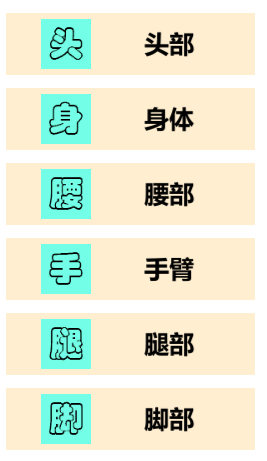
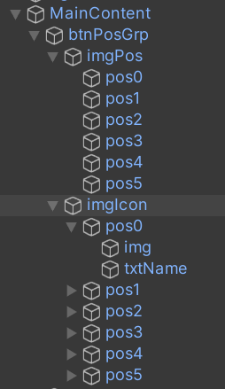
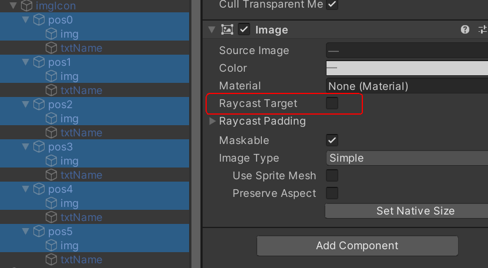
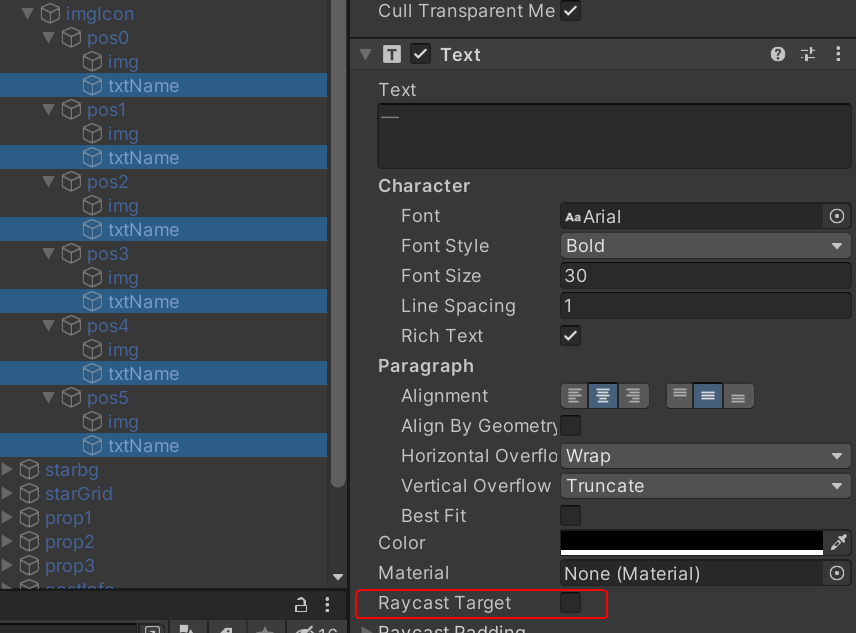
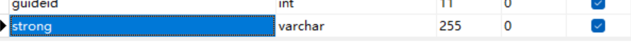
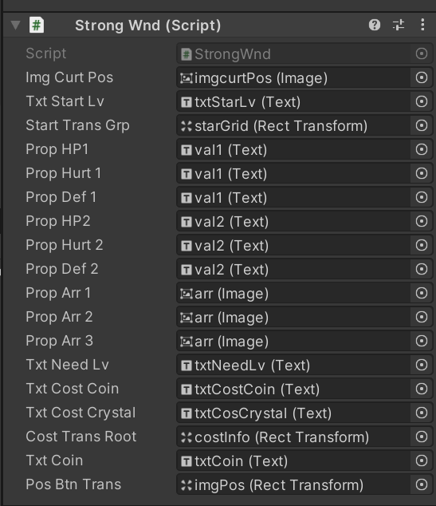
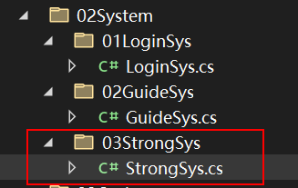
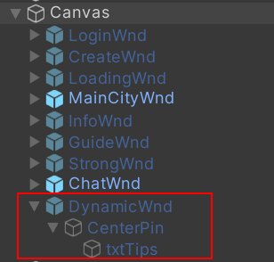

### 第7章-强化系统制作

#### 701-强化界面UI制作要点

左侧装备选项栏分成两种对象列表，一种保存选项栏位置，一种保存图片和文字，这样选中一个选项栏的时候只需要监控位置对象不需要判断图片和文字对象



#### 702-强化系统窗口界面脚本

新建StrongWnd.cs脚本并挂载到强化界面对象上，然后在MainCityWnd中增加新的打开强化界面函数ClickStrongBtn调用MainCitySys中新增的OpenStrongWnd函数来打开强化界面，同时需要在MainCitySys中增加强化系统窗口对象的引用，最后在Unity场景中增加强化按钮的点击事件

#### 703-选项栏点击事件

1. 首先在PEListener中增加鼠标点击事件监听函数

```cs
using UnityEngine.EventSystems;
//监听点击事件需要实现接口IPointerClickHandler 
public class PEListener : MonoBehaviour, IPointerClickHandler {
    //设置为object是为了对应下面args的类型
    public Action<object> onClick;
    //args设置为object是为了泛化，该例子中是在WindowRoot调用中赋值为了整型i
    public object args;
    //点击事件监听函数，一直监听点击是否发生，如果不为null则调用执行
    public void OnPointerClick(PointerEventData eventData) {
        if (onClick != null) {
            onClick(args);
        }
    }
}
```

2. 然后在WindowRoot中增加鼠标点击事件函数

```cs
using UnityEngine.EventSystems;

public class WindowRoot : MonoBehaviour {
    protected void OnClick(GameObject go, Action<object> cb, object args) {
        PEListener listener = GetOrAddComponent<PEListener>(go);
        listener.onClick = cb;
        //设置参数args是为了传入整型参数，类型为object是为了泛化
        listener.args = args;
    }
}
```

3. 最后在StrongWnd中进行调用

```cs
public class StrongWnd : WindowRoot {
    //获取选项栏的父对象的transform
    public Transform posBtnTrans;
    //存取六种选项栏的Image组件
    private Image[] imgs = new Image[6];
    //表示当前选中的选项栏索引
    private int currentIndex;

    protected override void InitWnd() {
        base.InitWnd();
        RegClickEvts();
        //初始化时默认显示第一个选项栏被选中
        ClickPosItem(0);
    }
    //该函数用来在初始化时注册点击事件
    private void RegClickEvts() {
        //遍历选项栏父对象底下的子对象
        for (int i = 0; i < posBtnTrans.childCount; i++) {
            //获取每个子对象的Image组件
            Image img = posBtnTrans.GetChild(i).GetComponent<Image>();
            /*
            在初始化时为每一个选项栏对象都添加了该注册事件，但由于没有触发点击事件则PELisenter中
            OnPointerClick不会执行，于是该匿名函数不会执行，所以也不会运行ClickPosItem函数
            */
            OnClick(img.gameObject, (object args) => {
                ClickPosItem((int)args);
                audioSvc.PlayUIAudio(Constants.UIClickBtn);
            }, i);
            imgs[i] = img;
        }
    }
    //该函数用来切换选择不同选项栏时图片的显示
    private void ClickPosItem(int index) {
        PECommon.Log("Click Item" + index);
        currentIndex = index;
        //遍历所有选项栏对象是否是当前点击的对象
        for (int i = 0; i < imgs.Length; i++)  {
            //若是则将颜色变为黄色
            if (i == currentIndex) {
                imgs[i].color = Color.yellow;
            }
            //不是则把颜色变为灰色
            else {
                imgs[i].color = Color.grey;
            }
        }
    }
}
```

4. 注意在Unity中取消不想监听的文字和图片的Raycast Target属性





#### 704-强化配置数据解析

1. 首先在BaseData中增加强化配置数据类

```cs
public class StrongCfg : BaseData<StrongCfg> {
    public int pos;
    public int starlv;
    public int addhp;
    public int addhurt;
    public int adddef;
    public int minlv;
    public int coin;
    public int crystal;
}
```

2. 在ResSvc服务类中进行解析

```cs
public class ResSvc : MonoBehaviour {
    //该字典为嵌套字典，首先根据位置pos索引找到对应内部字典，其中内部字典存放的时不同星级starlv对应的配置数据
    private Dictionary<int, Dictionary<int, StrongCfg>> strongDic = new Dictionary<int, Dictionary<int, StrongCfg>>();
    //该函数进行配置数据解析
    private void InitStrongCfg(string path) {
        TextAsset xml = Resources.Load<TextAsset>(path);
        if (!xml) {
            PECommon.Log("xml file:" + path + " not exist", LogTypeNew.Error);
        }
        else {
            XmlDocument doc = new XmlDocument();
            doc.LoadXml(xml.text);
            XmlNodeList nodLst = doc.SelectSingleNode("root").ChildNodes;
            for (int i = 0; i < nodLst.Count; i++) {
                XmlElement ele = nodLst[i] as XmlElement;
                if (ele.GetAttributeNode("ID") == null) {
                    continue;
                }
                int ID = Convert.ToInt32(ele.GetAttributeNode("ID").InnerText);
                StrongCfg sd = new StrongCfg {
                    ID = ID
                };
                foreach (XmlElement e in nodLst[i].ChildNodes) {
                    //由于配置数据都是int型因此可以在switch前就做变换
                    int val = int.Parse(e.InnerText);
                    switch (e.Name) {
                        case "pos":
                            sd.pos = val;
                            break;
                        case "starlv":
                            sd.starlv = val;
                            break;
                        case "addhp":
                            sd.addhp = val;
                            break;
                        case "addhurt":
                            sd.addhurt = val;
                            break;
                        case "adddef":
                            sd.adddef= val;
                            break;
                        case "minlv":
                            sd.minlv = val;
                            break;
                        case "coin":
                            sd.coin = val;
                            break;
                        case "crystal":
                            sd.crystal = val;
                            break;
                    }
                }
                //声明一个根据星级starlv找到配置数据的字典
                Dictionary<int, StrongCfg> dic = null;
                //先判断嵌套字典中是否存在该pos对应的内部字典
                if (strongDic.TryGetValue(sd.pos, out dic)) {
                    //若存在更新内部字典
                    dic.Add(sd.starlv, sd);
                }
                else {
                    //若不存在则新建一个内部字典对象
                    dic = new Dictionary<int, StrongCfg>();
                    dic.Add(sd.starlv, sd);
                    //更新完内部字典后将其加入嵌套字典中
                    strongDic.Add(sd.pos, dic);
                }
            }
        }
    }
    //该函数用来根据位置pos和该位置对应的星级starlv找到对应的强化配置数据
    public StrongCfg GetStrongData(int pos, int starlv) {
        StrongCfg sd = null;
        Dictionary<int, StrongCfg> dic = null;
        //判断嵌套字典中是否存在该pos对应的内部字典
        if (strongDic.TryGetValue (pos, out dic)) {
            //如果存在判断该内部字典是否存在键starlv
            if (dic.ContainsKey(starlv)) {
                sd = dic[starlv];
            }
        }
        return sd;
    }
}
```

3. 最后在ResSvc的初始化函数中调用该配置解析函数

#### 705-强化升级存储结构

1. 首先在GameMsg中增加强化升级存储字段

```cs
namespace PEProtocol {
    [Serializable]
    public class PlayerData {
        //索引表示位置pos，值表示星级starlv
        public int[] strongArr;
    }
}
```

2. 然后在数据库的表中增加相应字段，存储的数据格式为1#2#4#3#4#2#表示0号pos的星级starlv为1



3. 最后修改DBMgr中对应的查找，插入，更新函数

```cs
public class DBMgr {
    //查询玩家数据函数
    public PlayerData QueryPlayerData(string acct, string pass) {
        #region Strong
        //数据示意：1#2#2#4#3#7#
        string[] strongStrArr = reader.GetString("strong").Split('#');
        int[] _strongArr = new int[6];
        //遍历分割后的字符数组
        for (int i = 0; i < strongStrArr.Length; i++) {
            //因为最后一个为#符号会分割出""
            if (strongStrArr[i] == "") {
                continue;
            }
            //用TryParse判断能否正确转换成int类型
            if (int.TryParse(strongStrArr[i], out int starLv)) {
                _strongArr[i] = starLv;
            }
            else {
                PECommon.Log("Parse Strong Data Error", LogTypeNew.Error);
            }
        }
        //再将转换后的数据赋值给playerData
        playerData.strongArr = _strongArr;
        #endregion

        //创建新账号时加上
        strongArr = new int[6];
    }
    //插入新账号数据函数
    private int InsertNewAcctData(string acct, string pass, PlayerData pd) {
        MySqlCommand inc_cmd = new MySqlCommand("alter table account auto_increment=1", conn);
        inc_cmd.ExecuteNonQuery();
        //更改SQL语句，加上strong字段
        MySqlCommand cmd = new MySqlCommand("insert into account set strong=@strong", conn);
        string strongInfo = "";
        for (int i = 0; i < pd.strongArr.Length; i++) {
            strongInfo += pd.strongArr[i];
            //最后需要加上#符号
            strongInfo += "#";
        }
        cmd.Parameters.AddWithValue("strong", strongInfo);
    }
    //更新玩家数据函数
    public bool UpdatePlayerData(int id, PlayerData playerData) {
        //修改SQL语句，和上面操作类似
        MySqlCommand cmd = new MySqlCommand("update account set strong=@strong where id =@id", conn);
        string strongInfo = "";
        for (int i = 0; i < playerData.strongArr.Length; i++) {
            strongInfo += playerData.strongArr[i];
            strongInfo += "#";
        }
        cmd.Parameters.AddWithValue("strong", strongInfo);
    }
}
```

#### 706-强化系统逻辑实现

##### 706.1-强化UI界面逻辑

1. 首先在StrongWnd脚本中定义相关组件的引用，然后在Unity中对这些引用进行赋值

```cs
public class StrongWnd : WindowRoot {
    #region UI Define
    //表示当前选中的item图标
    public Image imgCurtPos;
    public Text txtStartLv;
    //表示显示星级图像的父物体Group对象
    public Transform startTransGrp;
    //1表示强化之前的数值
    public Text propHP1;
    public Text propHurt1;
    public Text propDef1;
    //2表示强化后的数值
    public Text propHP2;
    public Text propHurt2;
    public Text propDef2;
    //定义箭头对象是为了强化到满级时要取消显示箭头
    public Image propArr1;
    public Image propArr2;
    public Image propArr3;

    public Text txtNeedLv;
    public Text txtCostCoin;
    public Text txtCostCrystal;
    //表示显示需要消耗物品的父物体对象，为了强化到满级时要取消显示
    public Transform costTransRoot;
    public Text txtCoin;
    #endregion
}
```



2. 编写代码逻辑读取强化配置数据同时刷新这些组件的UI显示

```cs
public class StrongWnd : WindowRoot {
    //获取玩家对象数据
    private PlayerData pd;
    StrongCfg nextSd;
    protected override void InitWnd() {
        pd = GameRoot.Instance.PlayerData;
    }
    //在点击选项item后需要对UI显示进行刷新
    private void ClickPosItem(int index) {
        RefreshItem();
    }
    //刷新UI显示函数
    private void RefreshItem() {
        //显示当前玩家金币数量
        SetText(txtCoin, pd.coin);
        //判断当前选中的item并显示其图标
        switch (currentIndex) {
            case 0:
                SetSprite(imgCurtPos, PathDefine.ItemHead);
                break;
            case 1:
                SetSprite(imgCurtPos, PathDefine.ItemBody);
                break;
            case 2:
                SetSprite(imgCurtPos, PathDefine.ItemWaist);
                break;
            case 3:
                SetSprite(imgCurtPos, PathDefine.ItemHand);
                break;
            case 4:
                SetSprite(imgCurtPos, PathDefine.ItemLeg);
                break;
            case 5:
                SetSprite(imgCurtPos, PathDefine.ItemFoot);
                break;
        }
        //显示当前的星级txt
        SetText(txtStartLv, pd.strongArr[currentIndex] + "星级");

        int curtStarLv = pd.strongArr[currentIndex];
        //对显示星级的图标进行设置
        for (int i = 0; i < startTransGrp.childCount; i++) {
            Image img = startTransGrp.GetChild(i).GetComponent<Image>();
            //判断当前遍历的星级图标是否到达了该选项item的星级
            if (i < curtStarLv) {
                SetSprite(img, PathDefine.SpStar2);
            } 
            else {
                //超出当前星级的图标为灰色
                SetSprite(img, PathDefine.SpStar1);
            }
        }
        //调用资源服务中的函数对当前星级该item的数据进行累加
        int nextStartLv = curtStarLv + 1;
        int sumAddHp = resSvc.GetPropAddValPreLv(currentIndex, nextStartLv, 1);
        int sumAddHurt = resSvc.GetPropAddValPreLv(currentIndex, nextStartLv, 2);
        int sumAddDef = resSvc.GetPropAddValPreLv(currentIndex, nextStartLv, 3);
        SetText(propHP1, "生命 +" + sumAddHp);
        SetText(propHurt1, "伤害 +" + sumAddHurt);
        SetText(propDef1, "防御 +" + sumAddDef);

        //强化会提升一级星级
        nextSd = resSvc.GetStrongData(currentIndex, nextStartLv);
        if (nextSd != null) {
            //首先要对UI进行激活，保证其他item满级后取消激活了选中当前item也能正常显示
            SetActive(propHP2);
            SetActive(propHurt2);
            SetActive(propDef2);
            SetActive(costTransRoot);
            SetActive(propArr1);
            SetActive(propArr2);
            SetActive(propArr3);

            SetText(propHP2, "强化后 +" + nextSd.addhp);
            SetText(propHurt2, "            +" + nextSd.addhurt);
            SetText(propDef2, "            +" + nextSd.adddef);
            SetText(txtNeedLv, "需要等级 : " + nextSd.minlv);
            SetText(txtCostCoin, "需要消耗 :         " + nextSd.coin);
            SetText(txtCostCrystal, nextSd.crystal + "/" + pd.crystal);
        }
        else {
            //强化到满级了需要取消显示
            SetActive(propHP2, false);
            SetActive(propHurt2, false);
            SetActive(propDef2, false);
            SetActive(costTransRoot, false);
            SetActive(propArr1, false);
            SetActive(propArr2, false);
            SetActive(propArr3, false);
        }
    }
}
```

3. 在ResSvc资源服务中增加对应位置星级累加数据函数GetPropAddValPreLv

```cs
public class ResSvc : MonoBehaviour {
    //该函数用来计算当前位置该星级之前数据的和
    public int GetPropAddValPreLv(int pos, int starlv, int type) {
        Dictionary<int, StrongCfg> posDic = null;
        int val = 0;
        //首先判断是否存在内部星级字典
        if (strongDic.TryGetValue(pos, out posDic)) {
            //如果存在则对该星级之前的数据进行累加
            for (int i = 0; i < starlv; i++) {
                StrongCfg sd;
                //判断是否存在对应星级的数据
                if (posDic.TryGetValue(i, out sd)) {
                    switch (type) {
                        case 1://hp
                            val += sd.addhp;
                            break;
                        case 2://hurt
                            val += sd.addhurt;
                            break;
                        case 3://def
                            val += sd.adddef;
                            break;
                    }
                }
            }
        }
        return val;
    }
}
```

##### 706.2-强化系统中的网络通信

1. 首先定制网络通信协议，在服务端的PEProtocol中增加

```cs
namespace PEProtocol {
    [Serializable]
    public class GameMsg : PEMsg {
        public ReqStrong reqStrong;
        public RspStrong rspStrong;
    }

    #region 强化相关
    [Serializable]
    public class ReqStrong {
        //此处只需要传输最核心的数据，其他数据由服务端从数据库中获取计算
        public int pos;
    }
    [Serializable]
    public class RspStrong {
        public int coin;
        public int crystal;
        public int hp;
        public int ad;
        public int ap;
        public int addef;
        public int apdef;
        public int[] strongArr;
    }
    #endregion

    public enum ErrorCode {
        //新增错误码，防止客户端进行作弊
        LackLevel,
        LackCoin,
        LackCrystal
    }

    public enum CMD {
        ReqStrong = 203,
        RspStrong = 204
    }
}
```

2. 接着在客户端StrongWnd.cs中增加发送请求函数ClickStrongBtn，并在Unity中对相应按钮增加函数关联

```cs
public void ClickStrongBtn() {
    audioSvc.PlayUIAudio(Constants.UIClickBtn);
    //首先需要在客户端处对请求是否合理进行判断
    if (pd.strongArr[currentIndex] < 10) {
        if (pd.lv < nextSd.minlv) {
            GameRoot.AddTips("角色等级不够");
            return;
        }
        if (pd.coin < nextSd.coin) {
            GameRoot.AddTips("金币数量不够");
            return;
        }
        if (pd.crystal < nextSd.crystal) {
            GameRoot.AddTips("水晶数量不够");
            return;
        }
        //若合理则调用netSvc对象发送网络请求
        netSvc.SendMsg(new GameMsg {
            cmd = (int)CMD.ReqStrong,
            reqStrong = new ReqStrong {
                pos = currentIndex
            }
        });
    }
    else {
        GameRoot.AddTips("星级已经升满");
    }
}
```

3. 在服务端增加强化系统处理逻辑



```cs
public class Server {
    public void Init() {
        //增加强化业务系统初始化代码
        StrongSys.Instance.Init();
    }
}

public class NetSvc {
    private void HandOutMsg(MsgPack pack) {
        switch ((CMD)pack.msg.cmd) {
            //在网络服务层分发消息函数中增加强化请求处理分支
            case CMD.ReqStrong:
                StrongSys.Instance.ReqStrong(pack);
                break;
        }
    }
}
```

4. 在服务端增加强化数据配置解析函数，该部分代码可以参照客户端解析部分代码

```cs
public class CfgSvc {
    public void Init() {
        //初始化
        InitStrongCfg();
    }

    #region 强化数据配置
    private Dictionary<int, Dictionary<int, StrongCfg>> strongDic = new Dictionary<int, Dictionary<int, StrongCfg>>();
    private void InitStrongCfg() {
        XmlDocument doc = new XmlDocument();
        //客户端使用Load函数加载配置文件
        doc.Load(@"F:\ProjectFileFolder\UnityProject\UnityProject01\ResDarkGod\第4章\工程文件\DarkGod\Client\Assets\Resources\ResCfgs\strong.xml");
        XmlNodeList nodLst = doc.SelectSingleNode("root").ChildNodes;
        for (int i = 0; i < nodLst.Count; i++) {
            XmlElement ele = nodLst[i] as XmlElement;
            if (ele.GetAttributeNode("ID") == null) {
                continue;
            }
            int ID = Convert.ToInt32(ele.GetAttributeNode("ID").InnerText);
            StrongCfg sd = new StrongCfg {
                ID = ID
            };
            foreach (XmlElement e in nodLst[i].ChildNodes){
                int val = int.Parse(e.InnerText);
                switch (e.Name) {
                    case "pos":
                        sd.pos = val;
                        break;
                    case "starlv":
                        sd.starlv = val;
                        break;
                    case "addhp":
                        sd.addhp = val;
                        break;
                    case "addhurt":
                        sd.addhurt = val;
                        break;
                    case "adddef":
                        sd.adddef = val;
                        break;
                    case "minlv":
                        sd.minlv = val;
                        break;
                    case "coin":
                        sd.coin = val;
                        break;
                    case "crystal":
                        sd.crystal = val;
                        break;
                }
            }
            Dictionary<int, StrongCfg> dic = null;
            if (strongDic.TryGetValue(sd.pos, out dic)) {
                dic.Add(sd.starlv, sd);
            }
            else {
                dic = new Dictionary<int, StrongCfg>();
                dic.Add(sd.starlv, sd);
                strongDic.Add(sd.pos, dic);
            }
        }
        //加上配置读取成功日志
        PECommon.Log("StrongCfg Init Done.");
    }

    public StrongCfg GetStrongCfg(int pos, int starlv) {
        StrongCfg sd = null;
        Dictionary<int, StrongCfg> dic = null;
        if (strongDic.TryGetValue(pos, out dic)) {
            if (dic.ContainsKey(starlv)) {
                sd = dic[starlv];
            }
        }
        return sd;
    }
    #endregion
}
//定义强化配置数据类（和客户端相同）
public class StrongCfg : BaseData<StrongCfg> {
    public int pos;
    public int starlv;
    public int addhp;
    public int addhurt;
    public int adddef;
    public int minlv;
    public int coin;
    public int crystal;
}
```

5. 在服务端StrongSys中增加相应请求处理函数

```cs
using PEProtocol;

public class StrongSys {
    public void ReqStrong(MsgPack pack) {
        //将消息包转换成强化请求数据格式
        ReqStrong data = pack.msg.reqStrong;
        GameMsg msg = new GameMsg {
            cmd = (int)CMD.RspStrong
        };
        //从缓存中获取玩家数据
        PlayerData pd = cacheSvc.GetPlayerDataBySession(pack.session);
        int curtStartLv = pd.strongArr[data.pos];
        //从配置解析服务中获取该位置装备强化到下一级所需资源
        StrongCfg nextSd = CfgSvc.Instance.GetStrongCfg(data.pos, curtStartLv + 1);

        //条件判断
        if (pd.lv < nextSd.minlv) {
            msg.err = (int)ErrorCode.LackLevel;
        }
        else if (pd.coin < nextSd.coin) {
            msg.err = (int)ErrorCode.LackCoin;
        }
        else if (pd.crystal < nextSd.crystal) {
            msg.err = (int)ErrorCode.LackCrystal;
        }
        else {
            //资源扣除
            pd.coin -= nextSd.coin;
            pd.crystal -= nextSd.crystal;
            pd.strongArr[data.pos] += 1;

            //增加属性
            pd.hp += nextSd.addhp;
            pd.ad += nextSd.addhurt;
            pd.ap += nextSd.addhurt;
            pd.addef += nextSd.adddef;
            pd.apdef += nextSd.adddef;
        }

        //更新数据库
        if (!cacheSvc.UpdatePlayerData(pd.id, pd, pack.session)) {
            msg.err = (int)ErrorCode.UpdateDBError;
        }
        else {
            //最后生成强化请求回应对象
            msg.rspStrong = new RspStrong {
                coin = pd.coin,
                crystal = pd.crystal,
                hp = pd.hp,
                ad = pd.ad,
                ap = pd.ap,
                addef = pd.apdef,
                apdef = pd.apdef,
                strongArr = pd.strongArr
            };
        }
        //发送强化请求回应消息包
        pack.session.SendMsg(msg);
    }
}
```

6. 在客户端网络服务中增加消息分发处理分支

```cs
public class NetSvc : MonoBehaviour {
    private void ProcessMsg(GameMsg msg) {
        if (msg.err != (int)ErrorCode.None) {
            switch ((ErrorCode)msg.err) {
                case ErrorCode.LackLevel:
                    GameRoot.AddTips("角色等级不够");
                    break;
                case ErrorCode.LackCoin:
                    GameRoot.AddTips("金币数量不够");
                    break;
                case ErrorCode.LackCrystal:
                    GameRoot.AddTips("水晶数量不够");
                    break;
            }
            return;
        }
        switch ((CMD)msg.cmd) {
            case CMD.RspStrong:
                MainCitySys.Instance.RspStrong(msg);
                break;
        }
    }
}
```

7. 在主城业务系统中增加强化回应处理函数

```cs
public class MainCitySys : SystemRoot {
    #region StrongWnd
    public void RspStrong(GameMsg msg) {
        //计算强化之前玩家战力
        int fightPre = PECommon.GetFightByProps(GameRoot.Instance.PlayerData);
        //在GameRoot中对玩家信息进行更新
        GameRoot.Instance.SetPlayerDataByStrong(msg.rspStrong);
        //计算强化后玩家战力
        int fightNow = PECommon.GetFightByProps(GameRoot.Instance.PlayerData);
        GameRoot.AddTips(Constants.Color("战力提升了" + (fightNow - fightPre), TxtColor.Red));
        //强化完成后应该刷新界面UI
        strongWnd.UpdateUI();
        mainCityWnd.RefreshUI();
    }
    #endregion
}

//在GameRoot中增加对应函数
public class GameRoot : MonoBehaviour {
    //通过强化回应数据包来更新玩家数据
    public void SetPlayerDataByStrong(RspStrong data) {
        PlayerData.coin = data.coin;
        PlayerData.crystal = data.crystal;
        PlayerData.hp = data.hp;
        PlayerData.ad = data.ad;
        PlayerData.ap = data.ap;
        PlayerData.addef = data.addef;
        PlayerData.apdef = data.apdef;

        PlayerData.strongArr = data.strongArr;
    }
}

//在StrongWnd中增加刷新UI函数
public class StrongWnd : WindowRoot {
    public void UpdateUI() {
        audioSvc.PlayUIAudio(Constants.FBItemEnter);
        //此处刷新UI相当于重新点击了一次该位置装备
        ClickPosItem(currentIndex);
    }
}
```

8. 在Unity中需要保持DynamicWnd在最下方，否则弹出的tips会被其他窗口覆盖


