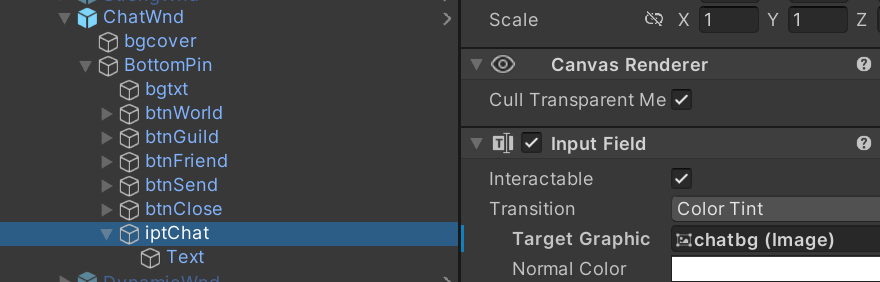

### 第8章-世界聊天系统与资源交易系统

#### 801-世界聊天系统开发

##### 801.1-UI界面及打开与关闭



创建脚本ChatWnd.cs并挂载到ChatWnd窗口上，添加关闭代码。然后在MainCityWnd中添加聊天窗口打开点击事件，最后通过MainCitySys进行打开，并且在Unity中添加相应按钮点击事件

```cs
public class ChatWnd : WindowRoot {
    public void ClickCloseBtn() {
        audioSvc.PlayUIAudio(Constants.UIClickBtn);
        SetWndState(false);
    }
}

public class MainCityWnd : WindowRoot {
    #region ClickEvts
    public void ClickChatBtn() {
        audioSvc.PlayUIAudio(Constants.UIOpenPage);
        MainCitySys.Instance.OpenChatWnd();
    }
    #endregion    
}

public class MainCitySys : SystemRoot {
    public ChatWnd chatWnd;    

    #region ChatWnd
    public void OpenChatWnd() {
        chatWnd.SetWndState();
    }
    #endregion
}
```

##### 802-按钮切换及UI刷新

```cs
using System;
using System.Collections;
using System.Collections.Generic;
using UnityEngine;
using UnityEngine.UI;

/// <summary>
/// 聊天界面窗口
/// </summary>

public class ChatWnd : WindowRoot {
    public InputField iptChat;
    public Text txtChat;
    public Image imgWorld;
    public Image imgGuild;
    public Image imgFriend;
    //chatType值分别代表了三个按钮
    private int chatType;
    //存储聊天信息
    private List<string> chatList = new List<string>();

    protected override void InitWnd() {
        base.InitWnd();
        chatType = 0;
        RefreshUI();
    }

    private void RefreshUI() {
        if (chatType == 0) {
            string chatMsg = "";
            for (int i = 0; i < chatList.Count; i++) {
                chatMsg += chatList[i] + "\n";
            }
            SetText(txtChat, chatMsg);
            SetSprite(imgWorld, "ResImages/btntype1");
            SetSprite(imgGuild, "ResImages/btntype2");
            SetSprite(imgFriend, "ResImages/btntype2");
        }
        else if (chatType == 1) {
            SetText(txtChat, "尚未加入公会");
            SetSprite(imgWorld, "ResImages/btntype2");
            SetSprite(imgGuild, "ResImages/btntype1");
            SetSprite(imgFriend, "ResImages/btntype2");
        }
        else if (chatType == 2) {
            SetText(txtChat, "暂无好友信息");
            SetSprite(imgWorld, "ResImages/btntype2");
            SetSprite(imgGuild, "ResImages/btntype2");
            SetSprite(imgFriend, "ResImages/btntype1");
        }
    }

    public void ClickSendBtn() {
        if (iptChat.text != null && iptChat.text != "" && iptChat.text != " ") {
            if (iptChat.text.Length > 12) {
                GameRoot.AddTips("输入信息不能超过12个字符");
            }
            else {
                //发送网络消息到服务器
            }
        }
        else {
            GameRoot.AddTips("尚未输入聊天信息");
        }
    }
    public void ClickWorldBtn() {
        audioSvc.PlayUIAudio(Constants.UIClickBtn);
        chatType = 0;
        RefreshUI();
    }
    public void ClickGuildBtn() {
        audioSvc.PlayUIAudio(Constants.UIClickBtn);
        chatType = 1;
        RefreshUI();
    }
    public void ClickFriendBtn() {
        audioSvc.PlayUIAudio(Constants.UIClickBtn);
        chatType = 2;
        RefreshUI();
    }
    public void ClickCloseBtn() {
        audioSvc.PlayUIAudio(Constants.UIClickBtn);
        chatType= 0;
        SetWndState(false);
    }
}
```
